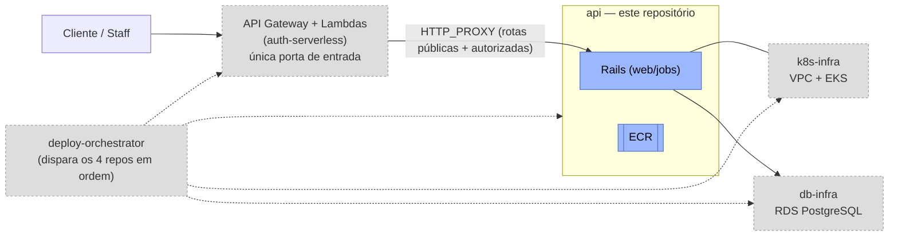
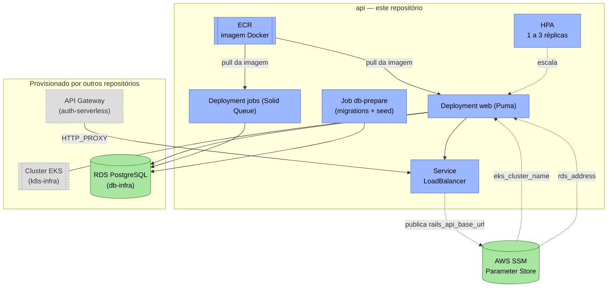
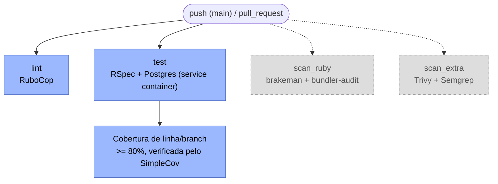
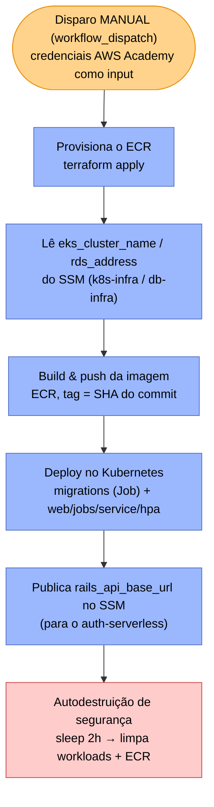

# 15SOAT - Fase 3 - Tech Challenge - Grupo 161

Sistema de gestão de oficina mecânica: uma API Rails que cobre todo o ciclo de vida de uma Ordem de Serviço (OS), da abertura ao orçamento, aprovação e entrega do veículo. A Fase 1 entregou a aplicação em **Domain-Driven Design (DDD)**; a Fase 2 evoluiu código e infraestrutura (Kubernetes, Terraform, HPA); a **Fase 3** adiciona **autenticação de clientes via CPF**, **autorização por papéis (RBAC)** e uma **arquitetura serverless** (AWS API Gateway + Lambda) como porta de entrada única — e separa o projeto em **5 repositórios independentes**, conforme exigido pelo desafio.

> A documentação das fases anteriores foi preservada: [Fase 1](docs/fase1/README.md) (arquitetura DDD, bounded contexts, event storming) e [Fase 2](docs/fase2/README.md) (Clean Code, Kubernetes/Terraform, HPA).

## Tecnologias utilizadas

| Categoria | Tecnologia |
| :--- | :--- |
| Linguagem / Framework | Ruby 3.4, Rails 8.1 (API-only) |
| Banco de dados | PostgreSQL (RDS gerenciado, provisionado pelo repositório [`db-infra`](https://github.com/FIAP-15SOAT-GabrielHelton/db-infra)) |
| Servidor de aplicação | Puma |
| Jobs assíncronos | Solid Queue (roda sobre o próprio Postgres, sem Redis) |
| Autenticação | JWT (`jwt`) — staff via e-mail/senha e clientes via CPF (bridge com o [`auth-serverless`](https://github.com/FIAP-15SOAT-GabrielHelton/auth-serverless)) |
| Documentação da API | OpenAPI/Swagger (`rswag`) |
| Testes | RSpec, FactoryBot, Faker, shoulda-matchers, SimpleCov (mínimo 80% linha/branch) |
| Qualidade / Segurança | RuboCop, Brakeman, bundler-audit, Trivy, Semgrep, SonarQube, OWASP ZAP |
| Deploy | Docker, Kubernetes (EKS, provisionado pelo [`k8s-infra`](https://github.com/FIAP-15SOAT-GabrielHelton/k8s-infra)), Terraform (ECR), Helm (metrics-server) |
| CI/CD | GitHub Actions |

## Objetivos desta fase

- **Autenticação de clientes via CPF**: identificação sem senha, emitindo um JWT (`role: "customer"`) para acesso escopado aos próprios dados.
- **RBAC (Role-Based Access Control)**: papéis `admin`, `receptionist`, `mechanic` (staff) e `customer`, com regras de acesso por rota/ação (matriz completa na RFC-001).
- **Arquitetura serverless como porta de entrada única**: AWS API Gateway + AWS Lambda (função de autenticação + Lambda Authorizer), num repositório dedicado.
- **Separação em 5 repositórios independentes**, cada um com CI/CD próprio: [`api`](https://github.com/FIAP-15SOAT-GabrielHelton/api) (este), [`k8s-infra`](https://github.com/FIAP-15SOAT-GabrielHelton/k8s-infra), [`db-infra`](https://github.com/FIAP-15SOAT-GabrielHelton/db-infra), [`auth-serverless`](https://github.com/FIAP-15SOAT-GabrielHelton/auth-serverless) e o auxiliar [`deploy-orchestrator`](https://github.com/FIAP-15SOAT-GabrielHelton/deploy-orchestrator).
- Documentar as decisões técnicas como **RFC** (com ADRs embutidos) — ver [`docs/fase3/RFC-001`](docs/fase3/RFC-001-authentication-authorization-serverless.md).

## Autenticação e RBAC

- **Staff** (`admin`/`receptionist`/`mechanic`): `POST /api/v1/auth/login` (e-mail/senha) → JWT `type: "access"`.
- **Cliente**: `POST /api/v1/auth/customer` (CPF) → JWT `type: "customer_access"`, `role: "customer"`. Em produção, essa rota é atendida pela Lambda `auth_customer` do [`auth-serverless`](https://github.com/FIAP-15SOAT-GabrielHelton/auth-serverless), que valida o formato do CPF e delega a este repositório (Single Source of Truth) a existência/status do cliente e a emissão do token.
- **Autorização**: o concern `JwtAuthenticatable` (`app/controllers/concerns/jwt_authenticatable.rb`) expõe `require_staff!`, `require_admin!`, `require_mechanic!`, `require_receptionist!`, `require_customer!` e o helper `forbidden_for_customer?` para checagem de ownership (cliente só acessa seus próprios veículos, OSs, orçamentos e cadastro).
- Matriz completa de permissões por rota: [RFC-001 §6](docs/fase3/RFC-001-authentication-authorization-serverless.md).

## Arquitetura

### Componentes da aplicação (neste repositório)

| Componente     | O que é                                                              | Onde roda                                                                |
| -------------- | -------------------------------------------------------------------- | ------------------------------------------------------------------------ |
| **web**        | API Rails (Puma), exposta via `/up`, `/api/v1/*`, `/api-docs`        | `Deployment` `oficina-mecanica-web` + `Service` LoadBalancer             |
| **jobs**       | Worker do Solid Queue (e-mails via SendGrid, jobs assíncronos)       | `Deployment` `oficina-mecanica-jobs`                                     |
| **db-prepare** | `bin/rails db:prepare` (migrations + seed) — roda uma vez por deploy | `Job` do Kubernetes, com `kubectl wait` bloqueando o deploy até concluir |
| **HPA**        | Escala o `web` por CPU (70%) e memória (80%), 1 a 3 réplicas         | `HorizontalPodAutoscaler` + `metrics-server` (do `k8s-infra`)            |

### Visão dos 5 repositórios



Detalhes de cada repositório, o contrato de dados entre eles (AWS SSM Parameter Store) e a ordem de deploy: [RFC-001 §7.3](docs/fase3/RFC-001-authentication-authorization-serverless.md).

### Infraestrutura deste repositório (Terraform, `infra/`) e sua relação com os demais

> VPC, EKS e RDS deixaram de ser provisionados aqui — foram extraídos para os repositórios [`k8s-infra`](https://github.com/FIAP-15SOAT-GabrielHelton/k8s-infra) e [`db-infra`](https://github.com/FIAP-15SOAT-GabrielHelton/db-infra), atendendo ao requisito do desafio de repositórios independentes. Este repositório provisiona só o **ECR** e faz o **deploy da aplicação** num cluster já existente. A troca de informação entre os 5 repositórios (cluster, banco, URL pública) acontece via **AWS SSM Parameter Store** — nenhum deles lê o `.tfstate` de outro.



- **ECR** (`infra/ecr.tf`): registry da imagem Docker da aplicação — único recurso de Terraform que sobrou neste repositório.
- **Deploy no Kubernetes** (`k8s/`): `Deployment` web + jobs, `Job` de migrations/seed, `Service` LoadBalancer e `HPA` — aplicados via `kubectl` num cluster provisionado pelo `k8s-infra` (nome lido do SSM).
- **RDS**: endpoint lido do SSM, publicado pelo `db-infra`.
- **API Gateway**: mora no `auth-serverless` e acessa o `Service` deste repositório via `HTTP_PROXY` direto ao hostname público do ELB (publicado por este repositório no SSM).
- Detalhes completos da separação e do contrato de dados: [RFC-001](docs/fase3/RFC-001-authentication-authorization-serverless.md) (ADR 5, 6 e 7).

### Fluxo de CI

Roda em todo `push` na `main` e em toda `pull_request` ([`ci.yml`](.github/workflows/ci.yml)):



> `scan_ruby` e `scan_extra` estão temporariamente desativados (`if: false` em `ci.yml`) — mantidos no workflow para reativação futura. Detalhes de cada scanner: [`docs/fase1/security.md`](docs/fase1/security.md).

### Fluxo de deploy (CD)



Este repositório é o **3º na ordem de deploy do projeto**: `k8s-infra → db-infra → api (este repo) → auth-serverless` — ou dispare todos de uma vez via o [`deploy-orchestrator`](https://github.com/FIAP-15SOAT-GabrielHelton/deploy-orchestrator). O deploy **nunca dispara sozinho**: é sempre acionado manualmente na aba **Actions → CD Deploy (App on EKS) → Run workflow**, informando as credenciais temporárias da sessão AWS Academy — mesma lógica do destroy manual imediato ([`cd_destroy.yml`](.github/workflows/cd_destroy.yml)). Detalhe de cada etapa: [`cd_deploy.yml`](.github/workflows/cd_deploy.yml) — ambos compartilham a lógica de destruição via a composite action [`infra-destroy`](.github/actions/infra-destroy/action.yml).

## Execução local

Apenas Docker é necessário:

```bash
git clone git@github.com:FIAP-15SOAT-GabrielHelton/api.git
cd api
cp .env.example .env
docker compose build
docker compose run --rm web bin/rails db:prepare
docker compose up
```

A API sobe em `http://localhost:3000` (Swagger em `/api-docs`). Detalhes de setup, credenciais de teste e troubleshooting: [`docs/fase1/README.md`](docs/fase1/README.md).

Para testar o fluxo completo de autenticação por CPF + API Gateway localmente (Lambdas do `auth-serverless` contra esta API Rails), veja o [README do `auth-serverless`](https://github.com/FIAP-15SOAT-GabrielHelton/auth-serverless#desenvolvimento-local).

## Deploy em Kubernetes

O deploy real acontece via GitHub Actions (aba **Actions → CD Deploy (App on EKS) → Run workflow**), informando as credenciais temporárias da sessão AWS Academy — **depois** que `k8s-infra` e `db-infra` já tiverem sido implantados. Para rodar manualmente contra um cluster já provisionado:

```bash
aws eks update-kubeconfig --name oficina-mecanica-cluster --region us-east-1

kubectl apply -f k8s/configmap.yaml -f k8s/secrets.yaml
kubectl apply -f k8s/db-prepare-job.yaml
kubectl wait --for=condition=complete --timeout=300s job/oficina-mecanica-db-prepare

kubectl apply -f k8s/web-deployment.yaml -f k8s/jobs-deployment.yaml -f k8s/service.yaml -f k8s/hpa.yaml

kubectl get svc oficina-mecanica-web-service   # EXTERNAL-IP é a URL pública (http://, porta 80)
```

> `k8s/configmap.yaml` e `k8s/secrets.yaml` contêm placeholders (`DATABASE_HOST_PLACEHOLDER`, `DATABASE_PASSWORD_PLACEHOLDER`, `SECRET_KEY_BASE_PLACEHOLDER`, `IMAGE_PLACEHOLDER`) — o workflow de CD os substitui automaticamente com `sed` a partir do SSM Parameter Store e dos GitHub Secrets. Para aplicar manualmente, substitua-os antes.

Em produção, a URL pública real do sistema é a do **API Gateway** (repositório `auth-serverless`), não a do `Service` acima — o ELB deste repositório é um destino interno do `HTTP_PROXY` do Gateway.

### Testando o autoscaling (HPA)

```bash
bin/test_hpa.sh start     # gera carga real contra o Service e acompanha o HPA em tempo real
bin/test_hpa.sh status    # snapshot único do HPA/pods/CPU, sem gerar carga
bin/test_hpa.sh stop      # remove o gerador de carga manualmente
```

O script sobe um `Deployment` auxiliar (`busybox`) batendo em `/up`, mostra `kubectl get hpa`/`top pods` em loop e remove tudo automaticamente ao encerrar com `Ctrl+C`.

## Provisionamento da infraestrutura (Terraform)

Este repositório só provisiona o **ECR** — pré-requisito: os repositórios [`k8s-infra`](https://github.com/FIAP-15SOAT-GabrielHelton/k8s-infra) e [`db-infra`](https://github.com/FIAP-15SOAT-GabrielHelton/db-infra) precisam ter sido implantados antes (publicam `eks_cluster_name`/`rds_address` no SSM, lidos em tempo de deploy).

```bash
cd infra/
terraform init \
  -backend-config="bucket=<nome-do-bucket-s3>" \
  -backend-config="key=oficina-mecanica/terraform.tfstate" \
  -backend-config="region=us-east-1"

terraform plan
terraform apply

terraform output ecr_repository_url
```

Ao final do uso, destrua os recursos para não consumir os créditos do AWS Academy:

```bash
terraform destroy
```

No pipeline de CI/CD, esses passos são automáticos — incluindo a limpeza de imagens do ECR e a espera pela liberação física do Load Balancer antes do `destroy`, feita na composite action [`infra-destroy`](.github/actions/infra-destroy/action.yml).

## Documentação da API

- **Swagger UI** (ambiente local): [`http://localhost:3000/api-docs`](http://localhost:3000/api-docs)
- **Swagger UI** (ambiente implantado): `http://<EXTERNAL-IP-do-Service>/api-docs` (ou, via o API Gateway em produção, `<url-do-api-gateway>/api-docs`)
- Spec OpenAPI versionada: [`swagger/v1/swagger.json`](swagger/v1/swagger.json)
- Walkthrough completo via `curl` cobrindo o ciclo de vida de uma OS: [`docs/fase1/demo.md`](docs/fase1/demo.md)
- Walkthrough via `curl` dos endpoints da Fase 2 (webhooks, rejeição direta, listagem priorizada): [`docs/fase2/demo.md`](docs/fase2/demo.md)
- Autenticação de cliente por CPF e RBAC: exemplos de request/response na [RFC-001 §5](docs/fase3/RFC-001-authentication-authorization-serverless.md)

## Vídeo demonstrativo

_[Youtube](https://www.youtube.com/watch?v=uv2nZvj7HSk)_ — gravado na Fase 2 (deploy, CI/CD, consumo das APIs e HPA sob carga). Ainda não há um vídeo específico da Fase 3.

## Segurança

Mantido da Fase 1 sem alterações — bundler-audit, brakeman, Trivy, Semgrep, SonarQube e OWASP ZAP. Detalhes, exemplos de output e workflow de remediação: [`docs/fase1/security.md`](docs/fase1/security.md).

## Testes

RSpec com FactoryBot, Faker e shoulda-matchers:

```bash
docker compose exec web bundle exec rspec
```

Detalhes da estrutura de `spec/` e comandos por camada: [`docs/fase1/README.md`](docs/fase1/README.md#testes).

## Documentação adicional

| Documento | Conteúdo |
| :--- | :--- |
| [`docs/fase1/README.md`](docs/fase1/README.md) | README original da Fase 1: stack, arquitetura DDD, bounded contexts, comandos úteis, troubleshooting |
| [`docs/fase1/event_storming.md`](docs/fase1/event_storming.md) | Event Storming dos 4 bounded contexts (diagramas Mermaid) |
| [`docs/fase1/demo.md`](docs/fase1/demo.md) | Walkthrough via `curl` do ciclo de vida completo de uma OS |
| [`docs/fase1/security.md`](docs/fase1/security.md) | Scanners de segurança (SAST/DAST), como rodar e remediar achados |
| [`docs/fase2/README.md`](docs/fase2/README.md) | README original da Fase 2: Clean Code, infraestrutura Kubernetes/Terraform, HPA |
| [`docs/fase2/demo.md`](docs/fase2/demo.md) | Walkthrough via `curl` dos endpoints refatorados/adicionados na Fase 2 |
| [`docs/fase3/RFC-001`](docs/fase3/RFC-001-authentication-authorization-serverless.md) | Autenticação via CPF, RBAC, arquitetura serverless e separação em 5 repositórios (ADRs 1-7) |
| [`docs/fase3/RFC-002`](docs/fase3/RFC-002-escolha-da-nuvem.md) | Escolha do provedor de nuvem (AWS/AWS Academy) e suas implicações arquiteturais |
| [`docs/fase3/RFC-003`](docs/fase3/RFC-003-escolha-do-banco-e-modelo.md) | Escolha do banco de dados (PostgreSQL), diagrama ER completo e explicação dos relacionamentos |
| [`docs/fase3/architecture/component-diagram.md`](docs/fase3/architecture/component-diagram.md) | Diagrama de componentes completo: nuvem, APIs, banco e monitoramento (atravessa os 5 repositórios) |
| [`docs/fase3/architecture/sequence-diagrams.md`](docs/fase3/architecture/sequence-diagrams.md) | Diagramas de sequência: autenticação por CPF, rota protegida (RBAC) e abertura de Ordem de Serviço |
| [`docs/fase3/architecture/adr-log.md`](docs/fase3/architecture/adr-log.md) | ADRs 8-10: padrão de comunicação (REST síncrono), uso de HPA, Clean Architecture/DDD |

## Repositórios do projeto (Fase 3)

| Repositório | Responsabilidade |
| :--- | :--- |
| `api` (este repositório) | Aplicação Rails, ECR e deploy no cluster |
| [`k8s-infra`](https://github.com/FIAP-15SOAT-GabrielHelton/k8s-infra) | VPC + EKS + node group |
| [`db-infra`](https://github.com/FIAP-15SOAT-GabrielHelton/db-infra) | RDS PostgreSQL |
| [`auth-serverless`](https://github.com/FIAP-15SOAT-GabrielHelton/auth-serverless) | API Gateway (porta de entrada única) + Lambdas de autenticação/RBAC |
| [`deploy-orchestrator`](https://github.com/FIAP-15SOAT-GabrielHelton/deploy-orchestrator) | Dispara e aguarda o deploy dos 4 repositórios acima, em ordem |
