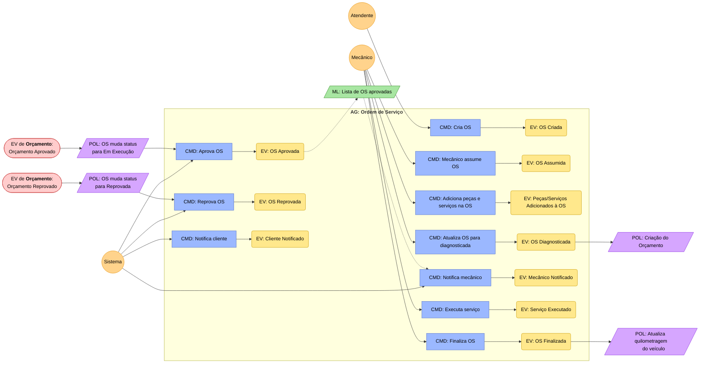
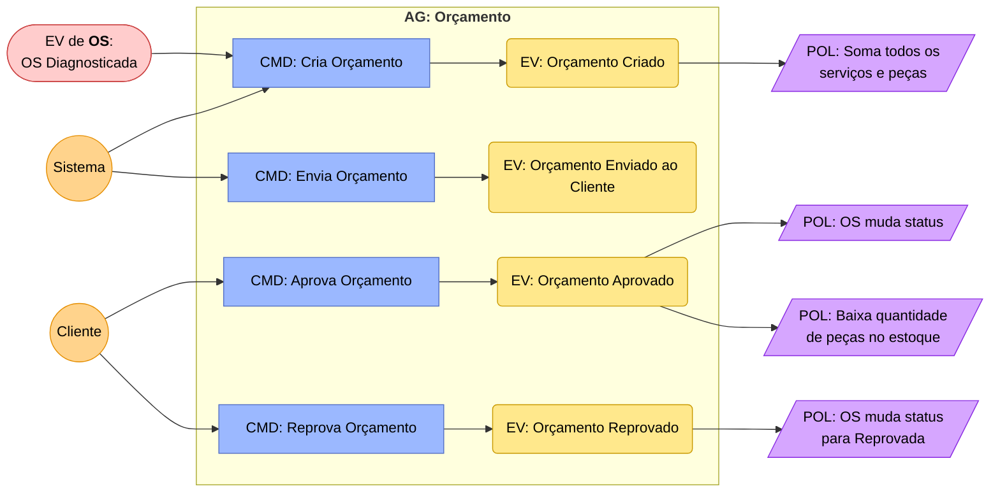
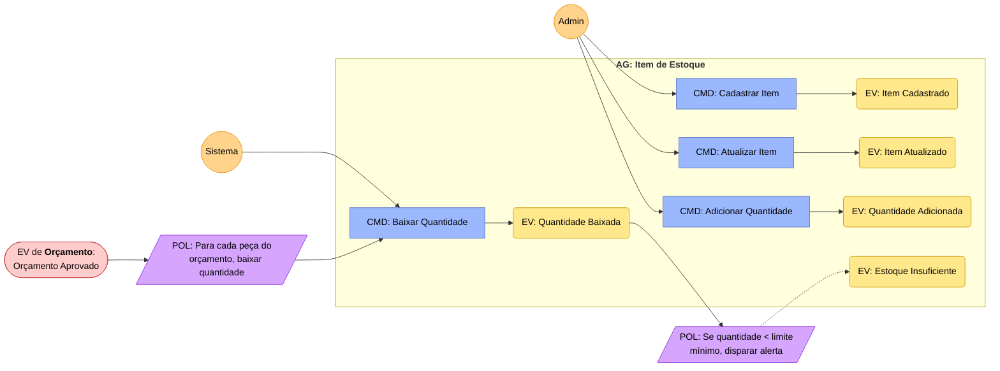
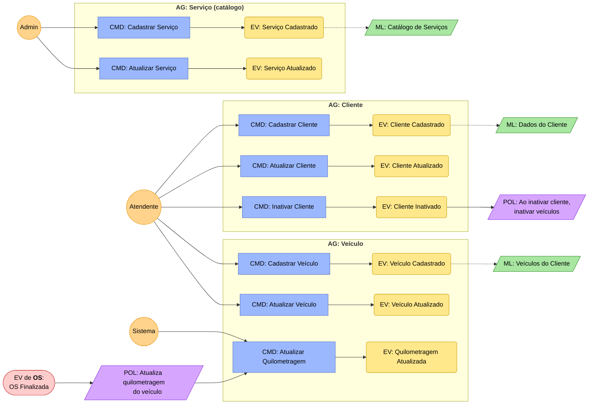

# Event Storming — Oficina Mecânica

> Diagrama completo dos 4 bounded contexts. Renderiza em qualquer ferramenta que suporte Mermaid (GitHub, Notion, VS Code, mermaid.live).
>
> **Última atualização:** 2026-04-12

## Visão geral dos contextos

```
          ┌───────────────┐
          │   CADASTROS   │  ◄── OsFinalizada (atualiza km)
          │  (supporting) │
          │ Cliente,       │
          │ Veículo,       │
          │ Serviço        │
          └───────┬───────┘
                  │ Dados-mestre (read models)
     ┌────────────┼────────────┐
     ▼            ▼            ▼
┌─────────┐  ┌─────────┐  ┌─────────┐
│ ORDENS  │  │ ORÇA-   │  │ ESTOQUE │
│   DE    │──│ MENTOS  │──│(support)│
│ SERVIÇO │  │         │  │         │
│ (core)  │  │ (core)  │  │         │
└─────────┘  └─────────┘  └─────────┘
      │            │            ▲
      │ OsDiag-    │ Orçamento  │ Orçamento
      │ nosticada  │ Aprovado   │ Aprovado
      └──────►─────┘──►────────►┘
```

---

## Bounded Context: ORDEM DE SERVIÇO (core)



### Status da OS

```
Recebida → Em diagnóstico → Aguardando aprovação → Em execução → Finalizada → Entregue
   │              │                   │                  │             │           │
 Cria OS    Mecânico assume    Orçamento enviado    Cliente      Mecânico     Veículo
             e diagnostica      ao cliente          aprova       finaliza     devolvido
```

---

## Bounded Context: ORÇAMENTO (core)



---

## Bounded Context: ESTOQUE (supporting — simplificado)



---

## Bounded Context: CADASTROS (supporting)



---

## Legenda

| Cor | Elemento | Descrição |
|---|---|---|
| 🔵 Azul | CMD | Comando (ação que alguém ou algo dispara) |
| 🟡 Amarelo | EV | Evento de domínio (fato que aconteceu) |
| 🟣 Roxo | POL | Política (reação automática a um evento) |
| 🟢 Verde | ML | Read Model (projeção de leitura) |
| 🟠 Laranja | Actor | Quem dispara o comando |
| 🔴 Vermelho claro | Cross-ctx | Evento vindo de outro bounded context |

## Fluxos cross-context (resumo)

```
OsDiagnosticada ──────────→ Orçamento: cria orçamento

OrcamentoAprovado ────────→ OS: muda status para "Em execução"
                  ────────→ Estoque: baixa quantidade das peças

OrcamentoReprovado ───────→ OS: muda status para "Reprovada"

OsFinalizada ─────────────→ Cadastros: atualiza quilometragem do veículo
```
