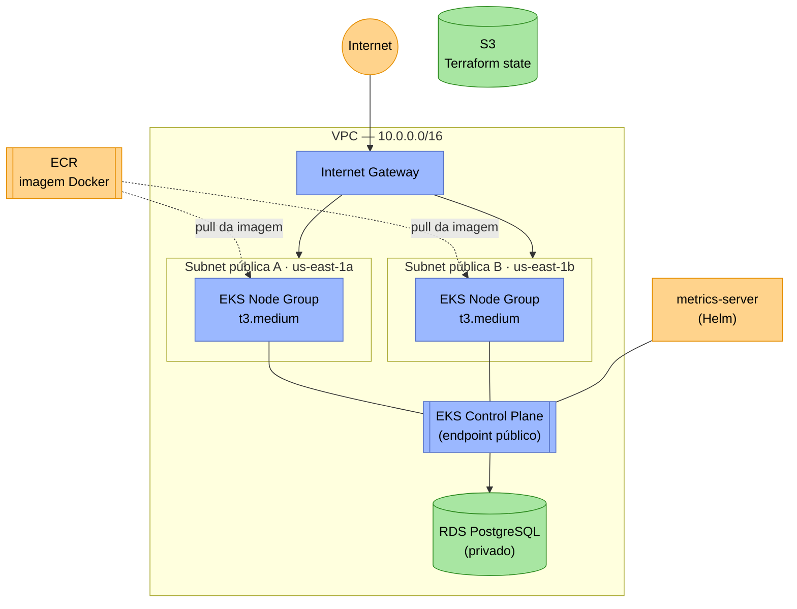
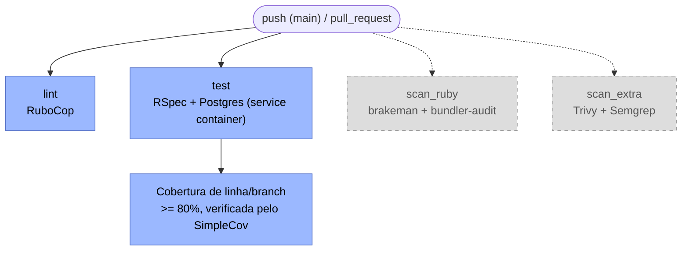
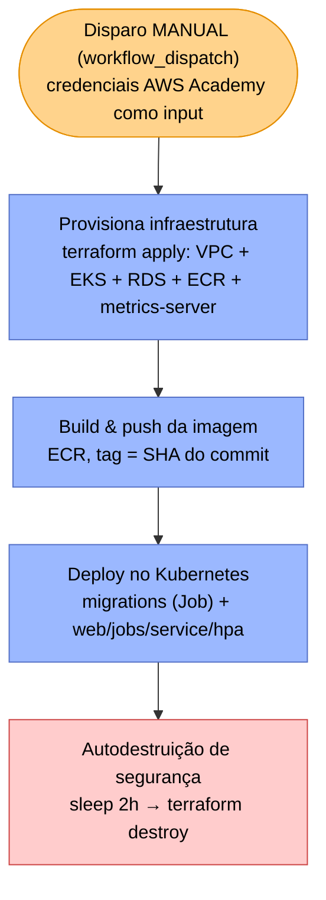

# 15SOAT - Fase 2 - Tech Challenge - Grupo 183

> Este é o README original da Fase 2. Para a visão atual do projeto (Fase 3: autenticação serverless, RBAC e arquitetura em 5 repositórios), veja o [README principal](../../README.md).

Sistema de gestão de oficina mecânica: uma API Rails que cobre todo o ciclo de vida de uma Ordem de Serviço (OS), da abertura ao orçamento, aprovação e entrega do veículo. A Fase 1 (Tech Challenge de pós-graduação FIAP) entregou a aplicação em **Domain-Driven Design (DDD)**; a Fase 2 evolui tanto o **código** (Clean Code, Clean Architecture, novas APIs) quanto a **infraestrutura**: cluster **Kubernetes (AWS EKS)** provisionado via **Terraform**, banco gerenciado **RDS**, deploy automatizado por **CI/CD** e **escalabilidade automática (HPA)**.

> A documentação completa da Fase 1 (arquitetura DDD, bounded contexts, event storming, walkthrough da API e scanners de segurança) foi preservada em [`docs/fase1/`](../fase1/README.md).

## Objetivos desta fase

- Refatorar o código existente aplicando **Clean Code** e reforçando a **Clean Architecture** já iniciada na Fase 1, sem abrir mão das regras de negócio.
- Ajustar e criar **APIs** conforme especificação: abertura de OS com serviços/peças, listagem ordenada com exclusão lógica, notificação de status por e-mail e rejeição de OS.
- Provisionar a infraestrutura (VPC, cluster, banco, registry) de forma **reproduzível e descartável** via Terraform — essencial no AWS Academy, onde a conta é temporária.
- Automatizar o ciclo completo de CI/CD via **GitHub Actions**: provisionar → buildar imagem → aplicar manifests → autodestruir por segurança.
- Expor **autoscaling horizontal (HPA)** da aplicação conforme a carga de CPU/memória.

## Evolução da aplicação (Clean Code / Clean Architecture)

A Fase 1 já estabeleceu a separação em camadas (`domains → application → infrastructure`, `controllers/jobs` como interface — [detalhes aqui](../fase1/README.md#arquitetura)). Nesta fase o código foi refatorado para reforçar essa separação e novas APIs foram implementadas conforme a especificação.

### Refatorações

| Mudança                                                              | Motivação                                                                                                                                                                                                                                                                   |
| -------------------------------------------------------------------- | --------------------------------------------------------------------------------------------------------------------------------------------------------------------------------------------------------------------------------------------------------------------------- |
| **Camada de Presenters** (`app/application/<domínio>/presenters/`)   | Controllers formatavam JSON manualmente e acessavam value objects de domínio (`Money`, `Document`, `LicensePlate`) diretamente. A serialização de saída virou responsabilidade de uma camada própria, mantendo a regra de dependência `controllers → application → domains` |
| **`WorkOrderNotifier` como orquestrador + `WorkOrderEmailNotifier`** | A notificação de mudança de status estava acoplada a e-mail. Virou um orquestrador _channel-agnostic_ que despacha para uma lista de notifiers — hoje só e-mail; adicionar SMS/push é um item novo na lista, sem tocar nos use cases                                        |

### APIs alteradas/criadas

| Requisito                                                                                            | Implementação                                                                                                                                                                                                                                                                                                                                                                                                            |
| ---------------------------------------------------------------------------------------------------- | ------------------------------------------------------------------------------------------------------------------------------------------------------------------------------------------------------------------------------------------------------------------------------------------------------------------------------------------------------------------------------------------------------------------------ |
| Abertura de OS recebendo cliente, veículo, serviços e peças                                          | `POST /api/v1/work_orders` passou a aceitar `line_items` já na criação, sem alterar o comportamento anterior (sem `line_items`, a OS continua abrindo como `received`)                                                                                                                                                                                                                                                   |
| Listagem de OS ordenada por status, mais antigas primeiro, sem finalizadas/entregues                 | `ActiveRecordWorkOrderRepository#search`: ordena por prioridade operacional (`in_progress → awaiting_approval → diagnosing → received`) e oculta `completed`/`delivered` do resultado padrão (exclusão lógica, não física)                                                                                                                                                                                               |
| Aprovação/recusa de orçamento (endpoint para notificação externa)                                    | `PATCH /api/v1/webhooks/quotes/:id/approve\|reject` (`Api::V1::Webhooks::QuotesController`), autenticado por segredo estático no header `X-Webhook-Token` — o endpoint público para notificação externa. `PATCH /api/v1/quotes/:id/approve\|reject` e `PATCH /api/v1/work_orders/:id/reject` (Fase 1, JWT de staff) seguem existindo para o fluxo interno, cobrindo as transições `received/diagnosing → rejected` da OS |
| Atualização de status da OS por ator externo (e-mail como exemplo de integração) _(ver nota abaixo)_ | Mesmos webhooks do item anterior (`PATCH /api/v1/webhooks/quotes/:id/approve\|reject`): delegam para os mesmos use cases `Quotes::ApproveQuote`/`Quotes::RejectQuote` usados pelos endpoints de staff, preservando máquina de estados, baixa de estoque e notificação                                                                                                                                                    |

> **Nota sobre a "atualização de status via e-mail":** validamos com o professor que o requisito pede apenas que um **ator externo** consiga disparar transição de status. Implementamos isso como `PATCH /api/v1/webhooks/quotes/:id/approve\|reject`, autenticados por um token estático (`X-Webhook-Token`) em vez do JWT de staff. Os webhooks são adapters de entrada que invocam os mesmos use cases (`Quotes::ApproveQuote`, `Quotes::RejectQuote`) — únicos autorizados a mutar o agregado `WorkOrder`/`Quote` e a validar a máquina de estados. Deliberadamente não criamos um endpoint que grave o status diretamente a partir de um evento externo, pulando esses use cases: isso duplicaria regra de negócio na borda — o que feriria o próprio DDD/Clean Architecture que este Tech Challenge pede para reforçar, já que a regra de transição de estado pertence ao agregado/use case, não ao adapter que a dispara.

### Testes automatizados

98 arquivos de spec (RSpec + FactoryBot + shoulda-matchers), com cobertura mínima de 80% linha/branch **verificada pelo SimpleCov na CI**. Cada mudança acima veio acompanhada de specs novos ou atualizados — unitários em `spec/application`/`spec/infrastructure`, de integração em `spec/requests`.

## Arquitetura

### Componentes da aplicação

| Componente     | O que é                                                              | Onde roda                                                                |
| -------------- | -------------------------------------------------------------------- | ------------------------------------------------------------------------ |
| **web**        | API Rails (Puma), exposta via `/up`, `/api/v1/*`, `/api-docs`        | `Deployment` `oficina-mecanica-web` + `Service` LoadBalancer             |
| **jobs**       | Worker do Solid Queue (e-mails via SendGrid, jobs assíncronos)       | `Deployment` `oficina-mecanica-jobs`                                     |
| **db-prepare** | `bin/rails db:prepare` (migrations + seed) — roda uma vez por deploy | `Job` do Kubernetes, com `kubectl wait` bloqueando o deploy até concluir |
| **PostgreSQL** | Banco único (app + Solid Queue), gerenciado                          | RDS (fora do cluster)                                                    |
| **HPA**        | Escala o `web` por CPU (70%) e memória (80%), 1 a 3 réplicas         | `HorizontalPodAutoscaler` + `metrics-server`                             |

### Infraestrutura provisionada (Terraform, `infra/`)



- **VPC** própria (`infra/vpc.tf`) com 2 subnets públicas (multi-AZ), Internet Gateway e route table — simplificada de propósito (sem NAT Gateway) para reduzir custo/complexidade no AWS Academy.
- **EKS** (`infra/eks.tf`, `infra/node_group.tf`): cluster gerenciado + node group de 1 a 3 instâncias `t3.medium`, usando o `LabRole` já disponível na conta AWS Academy (não é possível criar IAM roles próprias nesse ambiente).
- **RDS** (`infra/rds.tf`): PostgreSQL, não exposto publicamente — só acessível a partir do cluster.
- **ECR** (`infra/ecr.tf`): registry da imagem Docker da aplicação.
- **metrics-server** (`infra/metrics_server.tf`): instalado via provider Helm — pré-requisito para o HPA conseguir ler métricas de CPU/memória dos pods.
- **Backend do Terraform**: bucket S3 (`oficina-mecanica-tfstate-<account-id>`), criado via AWS CLI no início do pipeline para evitar o problema de "ovo e galinha" (o backend precisa existir antes do `terraform init`).

### Fluxo de CI

Roda em todo `push` na `main` e em toda `pull_request` ([`ci.yml`](../../.github/workflows/ci.yml)):



> `scan_ruby` e `scan_extra` estão temporariamente desativados (`if: false` em `ci.yml`) — mantidos no workflow para reativação futura. Detalhes de cada scanner: [`docs/fase1/security.md`](../fase1/security.md).

### Fluxo de deploy (CD)



Ao contrário do CI (que roda automaticamente em `push`/`pull_request`), o deploy **nunca dispara sozinho**: é sempre acionado manualmente na aba **Actions → CD Deploy (EKS & K8s) → Run workflow**, informando as credenciais temporárias da sessão AWS Academy — mesma lógica do destroy manual imediato ([`cd_destroy.yml`](../../.github/workflows/cd_destroy.yml)). Detalhe de cada etapa (bootstrap do bucket S3, ConfigMap/Secrets, `kubectl wait` na migration): [`cd_deploy.yml`](../../.github/workflows/cd_deploy.yml) — ambos compartilham a lógica de destruição via a composite action [`infra-destroy`](../../.github/actions/infra-destroy/action.yml).

## Execução local

Sem alterações em relação à Fase 1 — apenas Docker é necessário:

```bash
git clone git@github.com:<seu-usuario>/oficina_mecanica.git
cd oficina_mecanica
cp .env.example .env
docker compose build
docker compose run --rm web bin/rails db:prepare
docker compose up
```

A API sobe em `http://localhost:3000` (Swagger em `/api-docs`). Detalhes de setup, credenciais de teste e troubleshooting: [`docs/fase1/README.md`](../fase1/README.md).

## Deploy em Kubernetes

O deploy real acontece via GitHub Actions (aba **Actions → CD Deploy (EKS & K8s) → Run workflow**), informando as credenciais temporárias da sessão AWS Academy. Para rodar manualmente contra um cluster já provisionado:

```bash
aws eks update-kubeconfig --name oficina-mecanica-cluster --region us-east-1

kubectl apply -f k8s/configmap.yaml -f k8s/secrets.yaml
kubectl apply -f k8s/db-prepare-job.yaml
kubectl wait --for=condition=complete --timeout=300s job/oficina-mecanica-db-prepare

kubectl apply -f k8s/web-deployment.yaml -f k8s/jobs-deployment.yaml -f k8s/service.yaml -f k8s/hpa.yaml

kubectl get svc oficina-mecanica-web-service   # EXTERNAL-IP é a URL pública (http://, porta 80)
```

> `k8s/configmap.yaml` e `k8s/secrets.yaml` contêm placeholders (`DATABASE_HOST_PLACEHOLDER`, `DATABASE_PASSWORD_PLACEHOLDER`, `SECRET_KEY_BASE_PLACEHOLDER`, `IMAGE_PLACEHOLDER`) — o workflow de CD os substitui automaticamente com `sed` a partir dos outputs do Terraform e dos GitHub Secrets. Para aplicar manualmente, substitua-os antes.

### Testando o autoscaling (HPA)

```bash
bin/test_hpa.sh start     # gera carga real contra o Service e acompanha o HPA em tempo real
bin/test_hpa.sh status    # snapshot único do HPA/pods/CPU, sem gerar carga
bin/test_hpa.sh stop      # remove o gerador de carga manualmente
```

O script sobe um `Deployment` auxiliar (`busybox`) batendo em `/up`, mostra `kubectl get hpa`/`top pods` em loop e remove tudo automaticamente ao encerrar com `Ctrl+C`.

## Provisionamento da infraestrutura (Terraform)

```bash
cd infra/
terraform init \
  -backend-config="bucket=<nome-do-bucket-s3>" \
  -backend-config="key=oficina-mecanica/terraform.tfstate" \
  -backend-config="region=us-east-1"

terraform plan  -var="db_password=<senha-do-rds>"
terraform apply -var="db_password=<senha-do-rds>"

terraform output   # rds_address, eks_cluster_name, ecr_repository_url
```

Ao final do uso, destrua os recursos para não consumir os créditos do AWS Academy:

```bash
terraform destroy -var="db_password=<senha-do-rds>"
```

No pipeline de CI/CD, esses passos são automáticos — incluindo a limpeza de imagens do ECR e a espera pela liberação física dos Load Balancers antes do `destroy`, feita na composite action [`infra-destroy`](../../.github/actions/infra-destroy/action.yml).

## Documentação da API

- **Swagger UI** (ambiente local): [`http://localhost:3000/api-docs`](http://localhost:3000/api-docs)
- **Swagger UI** (ambiente implantado): `http://<EXTERNAL-IP-do-Service>/api-docs`
- Spec OpenAPI versionada: [`swagger/v1/swagger.json`](../../swagger/v1/swagger.json)
- Walkthrough completo via `curl` cobrindo o ciclo de vida de uma OS: [`docs/fase1/demo.md`](../fase1/demo.md)
- Walkthrough via `curl` só dos endpoints refatorados/adicionados na Fase 2 (webhooks, rejeição direta, listagem priorizada): [`docs/fase2/demo.md`](demo.md)

## Vídeo demonstrativo

_[Youtube](https://www.youtube.com/watch?v=uv2nZvj7HSk)_

Roteiro coberto (≤ 15 min): deploy da aplicação, execução do CI/CD, consumo das APIs e escalabilidade automática (HPA sob carga).

## Segurança

Mantido da Fase 1 sem alterações — bundler-audit, brakeman, Trivy, Semgrep, SonarQube e OWASP ZAP. Detalhes, exemplos de output e workflow de remediação: [`docs/fase1/security.md`](../fase1/security.md).

## Testes

RSpec com FactoryBot, Faker e shoulda-matchers — sem alterações na estrutura da Fase 1:

```bash
docker compose exec web bundle exec rspec
```

Detalhes da estrutura de `spec/` e comandos por camada: [`docs/fase1/README.md`](../fase1/README.md#testes).

## Documentação adicional

| Documento                                                      | Conteúdo                                                                                             |
| -------------------------------------------------------------- | ---------------------------------------------------------------------------------------------------- |
| [`docs/fase1/README.md`](../fase1/README.md)                 | README original da Fase 1: stack, arquitetura DDD, bounded contexts, comandos úteis, troubleshooting |
| [`docs/fase1/event_storming.md`](../fase1/event_storming.md) | Event Storming dos 4 bounded contexts (diagramas Mermaid)                                            |
| [`docs/fase1/demo.md`](../fase1/demo.md)                     | Walkthrough via `curl` do ciclo de vida completo de uma OS                                           |
| [`docs/fase1/security.md`](../fase1/security.md)             | Scanners de segurança (SAST/DAST), como rodar e remediar achados                                     |
| [`docs/fase2/demo.md`](demo.md)                     | Walkthrough via `curl` só dos endpoints refatorados/adicionados na Fase 2                            |
