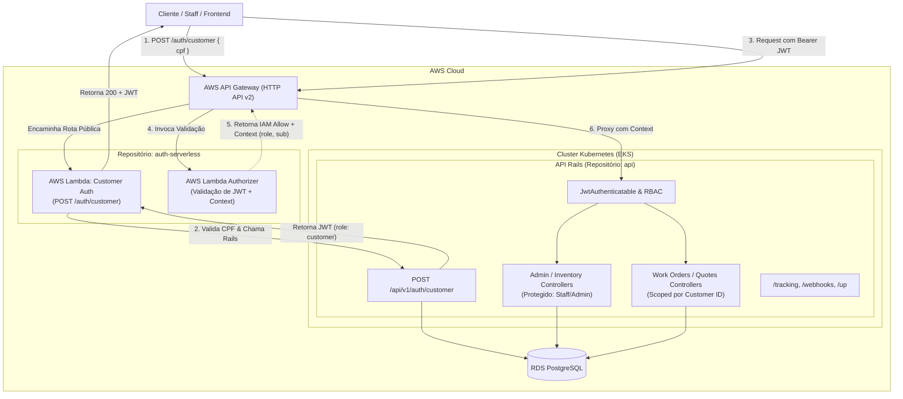
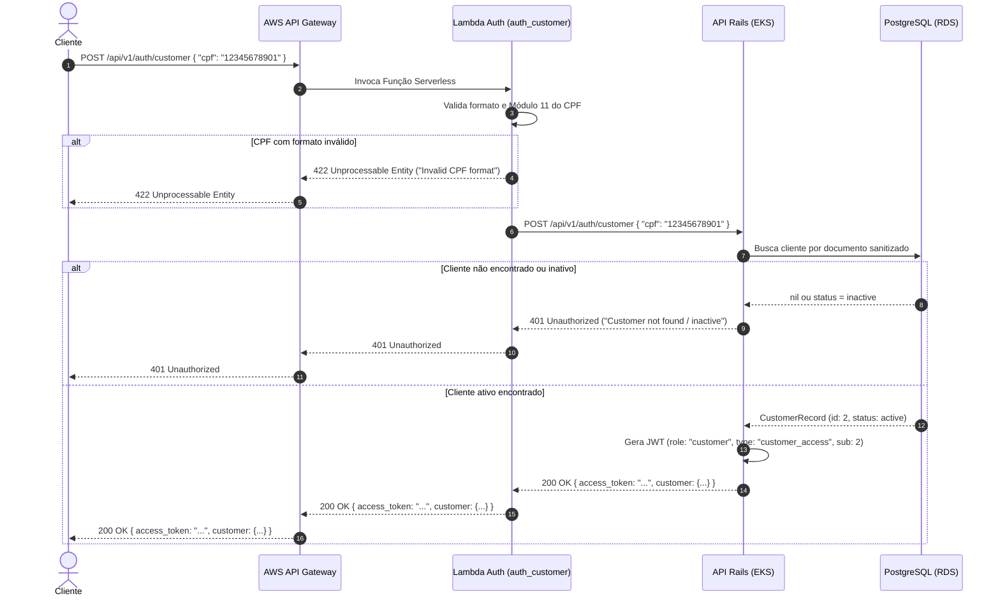
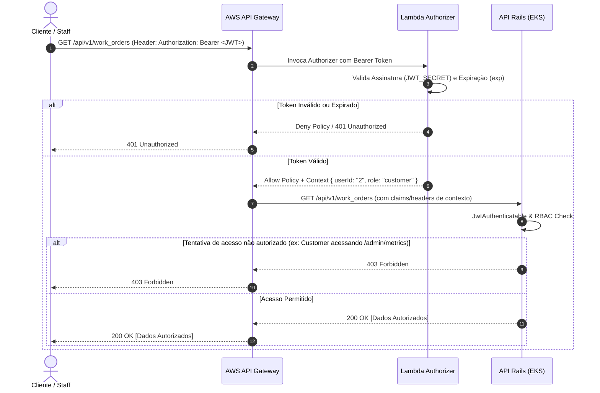

# RFC-001: Estratégia de Autenticação, Autorização (RBAC), Serverless Auth e AWS API Gateway

| Metadado | Detalhe |
| :--- | :--- |
| **Título** | Estratégia de Autenticação via CPF, Autorização (RBAC), Lambda Serverless e AWS API Gateway |
| **Status** | `PROPOSTO (DRAFT)` |
| **Autor(es)** | FIAP 15SOAT - Grupo 183 |
| **Data** | 31 de Agosto de 2026 |
| **Contexto** | Tech Challenge - Fase 3 |
| **Repositórios** | `api` (Rails Core), `k8s-infra` (Terraform EKS/VPC), `db-infra` (Terraform RDS), `auth-serverless` (AWS Lambda / Gateway) e `deploy-orchestrator` (CI/CD cross-repo) |
| **Status (atualização)** | A separação em 4 repositórios exigida pelo desafio (Lambda, Infra K8s, Infra DB, App principal) motivou o desmembramento do antigo `infra/` monolítico do `api` em `k8s-infra` e `db-infra`. O `deploy-orchestrator` é um 5º repositório auxiliar (fora da contagem dos 4 exigidos) que dispara e aguarda o deploy dos demais em sequência. Ver §7.3 e §8.3. |

---

## 1. Resumo Executivo (Summary)

Esta RFC define a arquitetura e as diretrizes de implementação para a **segregação da camada de autenticação/autorização**, introdução da **identificação de clientes via CPF**, integração com **AWS API Gateway** e **AWS Lambda (Serverless)**, bem como a definição da **matriz de controle de acesso baseado em papéis (RBAC)** para o sistema de gestão da Oficina Mecânica.

A solução estabelece a separação em dois repositórios independentes, utiliza **Terraform** como ferramenta única de infraestrutura como código (garantindo compatibilidade com o ambiente restrito do AWS Academy), implementa **Defesa em Profundidade** para garantir que clientes não acessem rotas administrativas, e disponibiliza um **ambiente de desenvolvimento local com Docker Compose**.

---

## 2. Motivação e Contexto Atual

### 2.1 Cenário Atual (Fases 1 e 2)
- **Autenticação de Staff**: A API Rails possui autenticação restrita a usuários internos (`User`: admin, mecânico, recepcionista) via e-mail e senha (`POST /api/v1/auth/login`), gerando tokens JWT (`type: "access"`).
- **Clientes (`Customer`)**: Estão cadastrados no banco de dados com documento (CPF/CNPJ) e status (`active`/`inactive`), porém **não possuem fluxo próprio de autenticação/identificação** para consultar ou interagir com o sistema.
- **Ponto de Entrada**: O tráfego chega diretamente ao Load Balancer do cluster Kubernetes (EKS), sem uma camada de API Gateway gerenciada na borda da AWS.

### 2.2 Requisitos da Fase 3
1. **AWS API Gateway**: Atuar como ponto central de entrada e roteamento.
2. **Autenticação Serverless via CPF**: Permitir que o cliente final se identifique apenas com o CPF, validando existência e status ativo, gerando um token JWT.
3. **Lambda Authorizer**: Proteger rotas sensíveis no API Gateway, validando o token JWT antes de encaminhar o tráfego para a API Rails.
4. **Segregação de Repositórios**: Manter a lógica serverless de autenticação em um repositório isolado (`auth-serverless`).
5. **Governança de Acesso (RBAC)**: Bloquear acessos de clientes a funcionalidades restritas da oficina (gestão de estoque, métricas de admin, diagnóstico e execução de OS).

---

## 3. Decisões Arquiteturais (Architecture Decision Records)

### ADR 1: Lógica de Autenticação via Bridge (API Rails como Single Source of Truth)
* **Decisão:** A Lambda Serverless de autenticação (`POST /auth/customer`) atuará como orquestradora/facade: ela validará o formato e os dígitos verificadores do CPF e consultará o endpoint interno da API Rails (`POST /api/v1/auth/customer`), que validará a existência/status no banco de dados e emitirá o JWT.
* **Justificativa:** Mantém a consistência de domínio (Clean Architecture e DDD). Evita duplicar modelos de dados, conexões de banco e regras de negócio de clientes dentro da função Lambda.

### ADR 2: Lambda Authorizer no API Gateway + Defesa em Profundidade na API
* **Decisão:** O AWS API Gateway utilizará um **Lambda Authorizer** para validação criptográfica do JWT na borda (Edge). A API Rails manterá a verificação interna e aplicará as regras de RBAC por rota.
* **Justificativa:** 
  - O API Gateway descarta requisições com tokens inválidos ou expirados sem onerar os pods da aplicação.
  - A API Rails não confia cegamente em cabeçalhos externos e aplica autorização granular baseada no domínio (`require_staff!`, `require_admin!`, `require_customer!`).

### ADR 3: Adoção Exclusiva de Terraform (IaC) para Deploy Serverless
* **Decisão:** A infraestrutura do API Gateway, Lambda Functions, IAM e integrações será provisionada exclusivamente via **Terraform**, descartando o Serverless Framework.
* **Justificativa:** 
  - **Compatibilidade AWS Academy**: O Serverless Framework cria CloudFormation stacks que tentam provisionar IAM Roles personalizadas, o que falha no ambiente do AWS Academy. Com Terraform, reaproveitamos a `LabRole` pré-existente (como já feito em `infra/eks.tf`).
  - **Padronização**: Todo o projeto já é gerenciado por Terraform e CI/CD via GitHub Actions.

### ADR 4: Ambiente Local Desacoplado com Docker Compose
* **Decisão:** O novo repositório `auth-serverless` conterá `Dockerfile` e `compose.yml`, executando um servidor local (Node.js/TypeScript) com hot-reload na porta `3001` conectado à API Rails (`http://host.docker.internal:3000`).

### ADR 5: Integração API Gateway → API Rails via HTTP Proxy Público (sem VPC Link)
* **Decisão:** O `Service` Kubernetes da API Rails (`oficina-mecanica-web-service`) é `type: LoadBalancer` (Classic ELB público). O API Gateway usa uma integração `HTTP_PROXY` apontando diretamente para o hostname público desse ELB, em vez de um `aws_apigatewayv2_vpc_link` privado.
* **Justificativa:** Evita provisionar um Network Load Balancer interno, Security Groups adicionais e subnets privadas — reduzindo a superfície de permissões exigidas no AWS Academy (`LabRole`). O API Gateway continua sendo a **única porta de entrada pública**: o cliente final nunca chama o ELB diretamente, apenas o Lambda Authorizer e o proxy do API Gateway o fazem internamente.

### ADR 6: Separação em Repositórios de Infraestrutura (`k8s-infra`, `db-infra`) e Orquestração de Deploy (`deploy-orchestrator`)
* **Decisão:** A infraestrutura antes centralizada em `api/infra/` (VPC, EKS, RDS, ECR) foi dividida em: `k8s-infra` (VPC + EKS + node group + metrics-server), `db-infra` (RDS) e `api` (mantém apenas ECR). Um 5º repositório, `deploy-orchestrator`, dispara e aguarda o `workflow_dispatch` de cada um dos 4 repositórios do desafio, em sequência, recebendo as credenciais efêmeras da sessão AWS Academy uma única vez.
* **Compartilhamento de configuração entre repositórios:** via **AWS SSM Parameter Store** — cada repositório publica os valores que expõe (`aws_ssm_parameter` no seu próprio Terraform) e os consumidores leem via `data "aws_ssm_parameter"` ou `aws ssm get-parameter`, evitando expor o `.tfstate` completo entre repositórios. Ver tabela de contrato em §7.3.
* **Justificativa:** Atende ao requisito do desafio de 4 repositórios independentes, cada um com seu próprio CI/CD e deploy automático, mantendo a dependência de dados entre eles explícita e auditável.

---

## 4. Arquitetura do Sistema e Fluxos

### 4.1 Visão Geral dos Componentes



---

### 4.2 Fluxo de Autenticação do Cliente (Sequência)



---

### 4.3 Fluxo de Consumo de Rota Protegida com Lambda Authorizer (Sequência)



---

## 5. Estratégia de Autenticação (Authentication)

### 5.1 Estrutura e Claims dos Tokens JWT

O sistema adota dois tipos de tokens de acesso, diferenciados pela claim `type` e `role`:

#### Token de Staff (Admin, Mecânico, Recepcionista)
```json
{
  "sub": 1,
  "role": "admin",
  "type": "access",
  "email": "admin@oficina.local",
  "iat": 1725148800,
  "exp": 1725152400
}
```

#### Token de Cliente Final (Customer)
```json
{
  "sub": 2,
  "cpf": "12345678901",
  "name": "Maria Souza",
  "email": "maria@email.com",
  "role": "customer",
  "type": "customer_access",
  "iat": 1725148800,
  "exp": 1725152400
}
```

### 5.2 Parâmetros de Segurança
* **Algoritmo:** HMAC-SHA256 (`HS256`).
* **Segredo Compartilhado:** `JWT_SECRET` (injetado via AWS Secrets Manager / Variáveis de Ambiente no EKS e nas Lambdas).
* **Tempo de Expiração (TTL):** 
  * Access Token: **1 hora** (3600 segundos).
  * Refresh Token: **7 dias** (aplicável para staff).

---

## 6. Estratégia de Autorização (RBAC)

Para impedir que clientes executem ações administrativas ou operacionais da oficina, o sistema define uma matriz de controle de acesso restrita:

### 6.1 Matriz de Permissões por Papel (RBAC Matrix)

| Endpoint / Recurso | Método | Público | Customer | Receptionist | Mechanic | Admin | Regra de Autorização |
| :--- | :--- | :---: | :---: | :---: | :---: | :---: | :--- |
| `POST /api/v1/auth/login` | POST | ✅ | ❌ | ✅ | ✅ | ✅ | Login de staff (email/senha) |
| `POST /api/v1/auth/customer` | POST | ✅ | ✅ | ❌ | ❌ | ❌ | Autenticação de cliente por CPF |
| `GET /api/v1/tracking/:protocol` | GET | ✅ | ✅ | ✅ | ✅ | ✅ | Rastreio de OS por protocolo |
| `PATCH /api/v1/webhooks/*` | PATCH | ✅ (Token) | ❌ | ❌ | ❌ | ❌ | Header `X-Webhook-Token` |
| `GET /up` | GET | ✅ | ✅ | ✅ | ✅ | ✅ | Healthcheck da API |
| `GET /api/v1/admin/metrics` | GET | ❌ | ❌ (403) | ❌ (403) | ❌ (403) | ✅ | Exclusivo de Admin (`require_admin!`) |
| `/api/v1/inventory_items/*` | ALL | ❌ | ❌ (403) | ✅ | ✅ | ✅ | Exclusivo de Staff (`require_staff!`) |
| `GET /api/v1/services` | GET | ❌ | ✅ | ✅ | ✅ | ✅ | Catálogo visível para todos autenticados |
| `/api/v1/services/*` (CUD) | POST/PATCH/DEL | ❌ | ❌ (403) | ❌ (403) | ❌ (403) | ✅ | Cadastro exclusivo de Admin |
| `GET /api/v1/work_orders` | GET | ❌ | ✅ (Próprias) | ✅ (Todas) | ✅ (Todas) | ✅ (Todas) | Customer visualiza apenas suas OSs |
| `POST /api/v1/work_orders` | POST | ❌ | ✅ | ✅ | ❌ | ✅ | Abertura de solicitação/OS |
| `PATCH /api/v1/work_orders/:id/assign` | PATCH | ❌ | ❌ (403) | ✅ | ❌ | ✅ | Atribuição de mecânico |
| `PATCH /api/v1/work_orders/:id/diagnose`| PATCH | ❌ | ❌ (403) | ❌ (403) | ✅ | ✅ | Diagnóstico e orçamento técnico |
| `PATCH /api/v1/work_orders/:id/execute` | PATCH | ❌ | ❌ (403) | ❌ (403) | ✅ | ✅ | Execução dos serviços da OS |
| `PATCH /api/v1/work_orders/:id/complete`| PATCH | ❌ | ❌ (403) | ❌ (403) | ✅ | ✅ | Finalização do trabalho técnico |
| `PATCH /api/v1/work_orders/:id/deliver` | PATCH | ❌ | ❌ (403) | ✅ | ❌ | ✅ | Entrega do veículo ao cliente |
| `GET /api/v1/quotes/:id` | GET | ❌ | ✅ (Seu orç.) | ✅ | ✅ | ✅ | Consulta de orçamento |
| `PATCH /api/v1/quotes/:id/approve\|reject`| PATCH | ❌ | ✅ (Seu orç.) | ✅ | ❌ | ✅ | Aprovação/recusa de orçamento |
| `GET /api/v1/customers` | GET | ❌ | ❌ (403) | ✅ | ❌ | ✅ | Listagem geral de clientes |
| `GET /api/v1/customers/:id` | GET | ❌ | ✅ (Seu id) | ✅ | ❌ | ✅ | Consulta de perfil |

### 6.2 Respostas de Erro Padronizadas
* **`401 Unauthorized`**: Token ausente, assinatura inválida, token expirado ou CPF/usuário inativo.
* **`403 Forbidden`**: Token válido, mas o usuário/cliente não possui privilégios para executar a ação solicitada.

---

## 7. Especificação Técnica dos Repositórios

### 7.1 Repositório Atual (`api` - Ruby on Rails)

#### Novos Casos de Uso
1. **`Registrations::AuthenticateCustomer`**:
   - Recebe `cpf`.
   - Normaliza e valida checksum usando `Registrations::ValueObjects::Document`.
   - Consulta `ActiveRecordCustomerRepository#find_by_document`.
   - Retorna `Result.success(customer)` ou falha com erro específico.
2. **`Registrations::IssueCustomerToken`**:
   - Recebe a entidade `Customer`.
   - Gera payload com `sub: customer.id`, `cpf`, `role: "customer"`, `type: "customer_access"`.
   - Assina com `Auth::JwtEncoder`.

#### Atualização de Segurança e RBAC
- Evolução do concern `JwtAuthenticatable`:
  - Métodos `require_staff!`, `require_admin!`, `require_mechanic!`, `require_customer!`.
  - Injeção de `@current_user` ou `@current_customer`.
- Proteção nos controllers:
  - `Api::V1::Admin::MetricsController` (`before_action :require_admin!`).
  - `Api::V1::InventoryItemsController` (`before_action :require_staff!`).
  - `Api::V1::WorkOrdersController` (`before_action :require_staff!, except: [:index, :show, :create]`).

---

### 7.2 Novo Repositório (`auth-serverless` - TypeScript / Node.js)

#### Estrutura do Projeto
```
auth-serverless/
├── .github/
│   └── workflows/
│       └── deploy.yml              # CI/CD via GitHub Actions + Terraform
├── docker/
│   └── Dockerfile                  # Container para desenvolvimento local
├── compose.yml                     # Docker Compose local
├── src/
│   ├── handlers/
│   │   ├── auth_customer.ts        # Lambda POST /auth/customer
│   │   └── lambda_authorizer.ts    # Lambda Authorizer do API Gateway
│   ├── utils/
│   │   ├── cpf_validator.ts        # Validador Módulo 11 de CPF
│   │   ├── jwt.ts                  # Utilitário de decodificação JWT
│   │   └── policy_generator.ts     # Construtor de IAM Policy (Allow/Deny)
│   ├── clients/
│   │   └── rails_client.ts         # Cliente Axios/Fetch para API Rails interna
│   └── local_server.ts             # Servidor Express/Fastify para dev local
├── infra/
│   ├── main.tf                     # Provisionamento das Lambdas e IAM Roles (LabRole)
│   ├── apigateway.tf               # Definição das rotas e Authorizer no API Gateway
│   ├── variables.tf
│   └── outputs.tf
├── package.json
└── tsconfig.json
```

#### Código do Lambda Authorizer (`src/handlers/lambda_authorizer.ts`)
```typescript
import jwt from 'jsonwebtoken';

interface JwtPayload {
  sub: string | number;
  role: string;
  type: string;
  cpf?: string;
  email?: string;
}

export const handler = async (event: any) => {
  const authHeader = event.headers?.authorization || event.headers?.Authorization;
  const token = authHeader?.replace(/^Bearer\s+/i, '');
  const methodArn = event.routeArn || event.methodArn;

  if (!token) {
    throw new Error('Unauthorized');
  }

  try {
    const secret = process.env.JWT_SECRET || 'secret';
    const decoded = jwt.verify(token, secret) as JwtPayload;

    return {
      principalId: String(decoded.sub),
      policyDocument: {
        Version: '2012-10-17',
        Statement: [
          {
            Action: 'execute-api:Invoke',
            Effect: 'Allow',
            Resource: methodArn,
          },
        ],
      },
      context: {
        userId: String(decoded.sub),
        role: decoded.role || 'customer',
        type: decoded.type,
        cpf: decoded.cpf || '',
      },
    };
  } catch (err) {
    throw new Error('Unauthorized');
  }
};
```

---

### 7.3 Separação em Repositórios de Infraestrutura e Contrato de Dados (SSM)

O desafio exige 4 repositórios independentes, cada um com CI/CD próprio e deploy automático: **Lambda** (`auth-serverless`), **Infra Kubernetes** (`k8s-infra`), **Infra do Banco Gerenciado** (`db-infra`) e **Aplicação principal** (`api`). Um 5º repositório auxiliar, `deploy-orchestrator`, orquestra o deploy dos 4 (ver §8.3).

Ordem de deploy: `k8s-infra → db-infra → api → auth-serverless` (destroy na ordem inversa). Os valores são compartilhados via **AWS SSM Parameter Store**:

| Parâmetro SSM | Publicado por | Consumido por |
| :--- | :--- | :--- |
| `/oficina-mecanica/vpc_id` | `k8s-infra` | `db-infra` |
| `/oficina-mecanica/subnet_ids` | `k8s-infra` | `db-infra` |
| `/oficina-mecanica/eks_cluster_name` | `k8s-infra` | `api` |
| `/oficina-mecanica/rds_address` / `rds_endpoint` | `db-infra` | `api` |
| `/oficina-mecanica/rails_api_base_url` | `api` (hostname do ELB, descoberto via `kubectl` pós-deploy) | `auth-serverless` |

---

## 8. Infraestrutura como Código (Terraform) & Deploy

### 8.1 Recursos Provisionados
1. **`aws_apigatewayv2_api`**: API Gateway HTTP API v2.
2. **`aws_apigatewayv2_authorizer`**: Integrado à Lambda `lambda_authorizer`.
3. **`aws_apigatewayv2_integration` (HTTP_PROXY)**: Conexão direta ao hostname público do ELB da API Rails (lido de `/oficina-mecanica/rails_api_base_url` via SSM) — sem VPC Link/NLB (ver ADR 5, §3).
4. **`aws_lambda_function`**:
   - `auth_customer`: Node.js 20.x, associada à role do AWS Academy (`LabRole`).
   - `lambda_authorizer`: Node.js 20.x, associada à `LabRole`.

### 8.2 Roteamento no API Gateway
* **Rotas Públicas (Sem Authorizer)**:
  * `POST /api/v1/auth/customer` -> Integração Lambda `auth_customer` (`AWS_PROXY`)
  * `POST /api/v1/auth/login` -> `HTTP_PROXY` direto ao ELB da API Rails
  * `GET /up` -> `HTTP_PROXY` direto ao ELB da API Rails
  * `GET /api/v1/tracking/{protocol}` -> `HTTP_PROXY` direto ao ELB da API Rails
  * `PATCH /api/v1/webhooks/{proxy+}` -> `HTTP_PROXY` direto ao ELB da API Rails
* **Rotas Protegidas (Com Lambda Authorizer)**:
  * `ANY /api/v1/{proxy+}` -> `HTTP_PROXY` ao ELB da API Rails, com Authorizer `jwt_authorizer`

Em todos os casos, o **API Gateway é a única porta de entrada pública**: o cliente nunca chama o ELB do EKS ou as Lambdas diretamente.

### 8.3 Orquestração de Deploy (`deploy-orchestrator`)
Workflow `workflow_dispatch` que recebe as credenciais da sessão AWS Academy **uma única vez** e dispara + aguarda (via GitHub CLI + PAT com escopo `repo`+`workflow` nos 4 repositórios) o `cd_deploy.yml` de cada repositório, em sequência: `k8s-infra → db-infra → api → auth-serverless`, interrompendo a cadeia caso algum passo falhe. Cada repositório mantém seu próprio `workflow_dispatch` independente, podendo também ser disparado isoladamente.

---

## 9. Plano de Testes e Validação

### 9.1 Testes Unitários e de Integração (Rails API)
* `spec/application/registrations/authenticate_customer_spec.rb`:
  * CPF válido e cadastrado (ativo) -> `Result.success`
  * CPF inexistente na base -> `Result.failure("Customer not found")`
  * CPF de cliente inativo -> `Result.failure("Customer is inactive")`
  * CPF inválido (formato/dígitos) -> `Result.failure("Invalid CPF")`
* `spec/requests/api/v1/admin/metrics_spec.rb`:
  * Acesso com token de `Customer` -> `403 Forbidden`
  * Acesso com token de `Admin` -> `200 OK`
* `spec/requests/api/v1/inventory_items_spec.rb`:
  * Acesso com token de `Customer` -> `403 Forbidden`
  * Acesso com token de `Mechanic`/`Admin` -> `200 OK`

### 9.2 Testes no Repositório Serverless
* Testes unitários Jest para `cpf_validator.ts` e `jwt.ts`.
* Teste do gerador de políticas IAM do authorizer para tokens válidos, inválidos e expirados.

---

## 10. Alternativas Consideradas e Trade-offs

| Alternativa | Prós | Contras | Decisão |
| :--- | :--- | :--- | :--- |
| **Lambda conectando diretamente ao RDS Postgres** | Elimina uma chamada HTTP entre Lambda e API Rails. | Exige VPC Peering/RDS Proxy para a Lambda; duplica entidades e regras de banco fora do Rails API. | **Rejeitado:** Viola a separação de domínios DDD da API central. |
| **Serverless Framework (Serverless.yml)** | Sintaxe simples para declarar Lambdas e API Gateway. | Criação de roles IAM customizadas falha no AWS Academy; dependência de plugins externos. | **Rejeitado:** Manter 100% Terraform garante uso da `LabRole` e alinhamento com a infra existente. |
| **Monorepo** | Mantém todo o código no mesmo repositório git. | Não atende ao requisito explícito de segregação de repositórios do desafio. | **Rejeitado:** Segregação em repositório `auth-serverless` dedicado. |
| **VPC Link privado (NLB interno) entre API Gateway e EKS** | Não expõe o ELB da aplicação publicamente; mais "correto" arquiteturalmente. | Exige provisionar NLB interno, Security Groups e subnets privadas extras — maior risco de bloqueio de permissões no AWS Academy (`LabRole`). | **Rejeitado:** Integração `HTTP_PROXY` direta ao ELB público existente (ADR 5), mantendo o API Gateway como única porta de entrada pública. |
| **Terraform remote state entre os 4 repositórios de infra** | Reaproveita o bucket S3 de tfstate já existente; mais "Terraform-nativo". | Expõe o `.tfstate` completo (podendo conter dados sensíveis) entre repositórios. | **Rejeitado:** AWS SSM Parameter Store (ADR 6) — cada repo publica só os valores que quer expor. |

---

## 11. Conclusão e Próximos Passos

A arquitetura descrita nesta RFC oferece um desacoplamento limpo entre o serviço de autenticação serverless e a API central de negócios, cumprindo os requisitos de segurança, escalabilidade na borda (Edge) e governança por papéis (RBAC).

**Ações Imediatas:**
1. Validação e aprovação final da RFC.
2. Criação dos casos de uso de autenticação de cliente e proteções RBAC na API Rails (`api`).
3. Setup e disponibilização dos arquivos do repositório `auth-serverless`.
