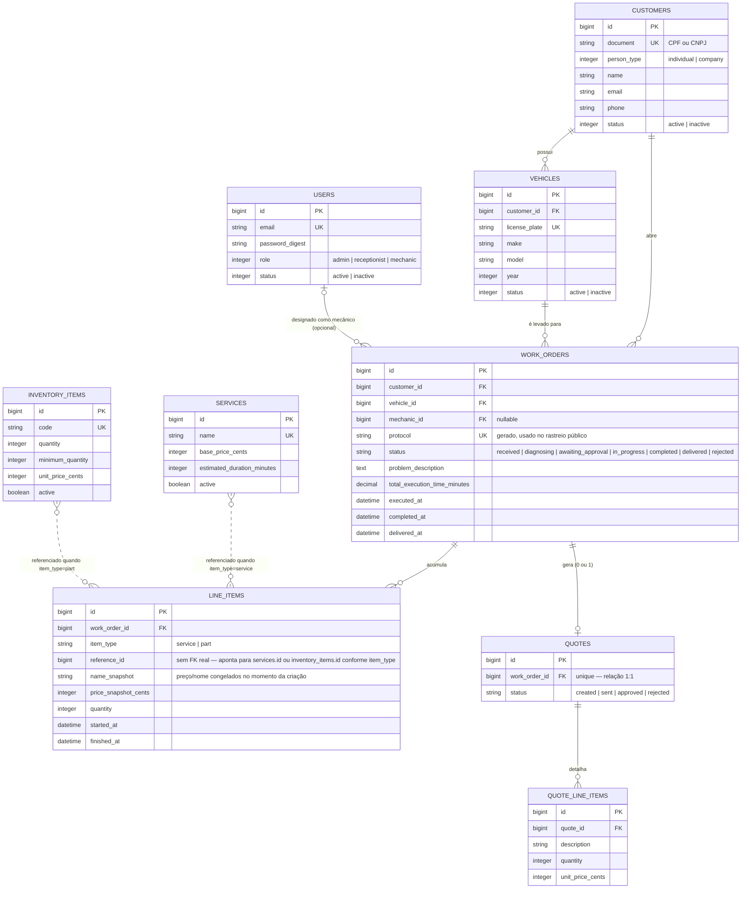

# RFC-003: Escolha do Banco de Dados e Modelo Relacional

| Metadado | Detalhe |
| :--- | :--- |
| **Título** | Escolha do Banco de Dados (PostgreSQL) e Justificativa do Modelo Relacional |
| **Status** | `ACEITO` |
| **Autor(es)** | FIAP 15SOAT - Grupo 161 |
| **Data** | 04 de Setembro de 2026 |
| **Contexto** | Tech Challenge - Fase 1 (decisão original) e Fase 3 (formalização + diagrama ER exigido) |
| **Repositórios afetados** | `api`, `db-infra` |

---

## 1. Resumo Executivo

Esta RFC justifica formalmente a escolha do **PostgreSQL** (gerenciado via **AWS RDS** em produção — repositório [`db-infra`](https://github.com/FIAP-15SOAT-GabrielHelton/db-infra)) como banco de dados único do projeto Oficina Mecânica, e documenta o **modelo relacional completo** (diagrama ER e explicação de cada relacionamento).

## 2. Motivação e Contexto

O domínio da Oficina Mecânica é fundamentalmente **relacional e transacional**: uma Ordem de Serviço (OS) referencia um cliente e um veículo específicos, acumula itens de linha (serviços/peças) com preços "congelados" no momento da execução, e sua aprovação de orçamento precisa **atualizar múltiplas tabelas de forma atômica** (orçamento, OS e estoque). Além disso, o Rails 8 introduziu Solid Queue e Solid Cache, que rodam sobre o próprio banco relacional da aplicação — eliminando a necessidade de um serviço separado (Redis) para filas e cache.

## 3. Alternativas Consideradas

| Alternativa | Prós | Contras | Decisão |
| :--- | :--- | :--- | :--- |
| **PostgreSQL** | Suporte nativo a transações ACID multi-tabela (crítico para aprovação de orçamento: baixar estoque + atualizar OS + salvar orçamento numa única transação — ver `Quotes::ApproveQuote`); constraints de integridade referencial (FKs) e unicidade a nível de banco; suporta Solid Queue/Solid Cache do Rails 8 sem serviço extra; gerenciado nativamente pelo RDS na AWS. | Escala verticalmente antes de exigir sharding (não é um problema neste projeto). | **Aceito** |
| **MySQL** | Também relacional, ACID, suportado pelo RDS. | Sem vantagem concreta sobre o PostgreSQL para este domínio; equipe com mais familiaridade prévia com Postgres. | Rejeitado — sem diferencial |
| **MongoDB / NoSQL documental** | Schema flexível; escala horizontalmente com facilidade. | **Não suporta transações multi-documento com a mesma robustez/maturidade** que o Postgres oferece nativamente para o fluxo de aprovação de orçamento; o domínio já é fortemente relacional (ver Event Storming em `docs/fase1/event_storming.md`), então schema flexível não é vantagem — seria trabalho extra modelar relacionamentos que o modelo relacional já resolve de forma nativa. | Rejeitado — desalinhado com o domínio |
| **DynamoDB** | Serverless, sem gestão de instância, integra bem com Lambda. | Modelo de acesso por chave/índice exige desenhar toda consulta de antemão (ex: listagem de OS filtrada por status, cliente e mecânico simultaneamente, como já implementado em `ActiveRecordWorkOrderRepository#search`, é natural em SQL e trabalhosa em DynamoDB); sem suporte a transações multi-tabela tão maduro quanto o Postgres; exigiria reescrever todo o Rails para outro paradigma de persistência. | Rejeitado — inadequado para o volume de consultas relacionais já existentes |

## 4. Decisão

Adotar **PostgreSQL** como único banco de dados do projeto — um schema para os dados de domínio (clientes, veículos, OS, orçamentos, estoque, usuários) e o mesmo banco também hospedando as tabelas do Solid Queue (jobs assíncronos) e Solid Cache, sem necessidade de Redis. Em produção, a instância é gerenciada via **AWS RDS**, provisionada pelo repositório [`db-infra`](https://github.com/FIAP-15SOAT-GabrielHelton/db-infra) (ver [RFC-002](RFC-002-escolha-da-nuvem.md) para o contexto AWS).

## 5. Modelo Relacional

### 5.1 Diagrama ER

### 5.2 Explicação dos Relacionamentos

| Relacionamento | Cardinalidade | Explicação |
| :--- | :--- | :--- |
| `customers` → `vehicles` | 1:N | Um cliente pode ter vários veículos cadastrados; cada veículo pertence a exatamente um cliente (`vehicles.customer_id`, FK obrigatória). |
| `customers` → `work_orders` | 1:N | Um cliente pode abrir várias Ordens de Serviço ao longo do tempo; cada OS pertence a exatamente um cliente (`work_orders.customer_id`, FK obrigatória). Usado pelo helper `forbidden_for_customer?` para escopar o acesso de clientes só às próprias OSs. |
| `vehicles` → `work_orders` | 1:N | Um veículo pode ter várias OSs (visitas) ao longo da vida útil; cada OS referencia exatamente um veículo (`work_orders.vehicle_id`). `CreateWorkOrder` valida que o veículo informado **pertence** ao `customer_id` da própria OS — evitando que uma OS vincule o veículo de outro cliente. |
| `users` → `work_orders` (mecânico) | 1:N, **opcional** | Uma OS pode não ter mecânico designado ainda (`mechanic_id` é `nullable`, preenchido só na ação `assign`); um usuário com papel `mechanic` pode estar designado a várias OSs. FK usa `on_delete: :nullify` — se o usuário for removido, a OS não é apagada, só perde a referência ao mecânico. |
| `work_orders` → `line_items` | 1:N | Uma OS acumula os serviços/peças usados (itens de linha); cada item pertence a exatamente uma OS. |
| `line_items` → `services` / `inventory_items` | **polimórfico, sem FK de banco** | `line_items.reference_id` aponta para `services.id` **ou** `inventory_items.id`, dependendo do discriminador `item_type` (`"service"`/`"part"`) — por isso não existe `add_foreign_key` real para essa coluna (uma FK de banco só pode apontar para uma tabela). A integridade é garantida na camada de aplicação (`WorkOrders::CreateWorkOrder#fetch_snapshot`). **Decisão de modelagem deliberada**: `name_snapshot` e `price_snapshot_cents` **congelam** o nome/preço do serviço ou peça no momento em que o item é adicionado à OS — se o catálogo de serviços ou o preço de uma peça mudar depois, OSs já abertas não são afetadas retroativamente. |
| `work_orders` → `quotes` | **1:1, opcional** | Uma OS gera **no máximo um** orçamento (índice único em `quotes.work_order_id`), criado automaticamente ao diagnosticar a OS (`diagnose`). Uma OS pode não ter orçamento ainda (antes do diagnóstico). |
| `quotes` → `quote_line_items` | 1:N | Um orçamento é composto por vários itens de linha (cópia dos itens da OS, para o cliente visualizar antes de aprovar). |

### 5.3 Ajustes feitos ao modelo durante o projeto

- **Separação `line_items` (na OS) vs. `quote_line_items` (no orçamento)**: inicialmente poderiam ser a mesma tabela, mas foram separadas porque representam momentos diferentes do ciclo de vida — `line_items` reflete o que está sendo executado na OS (com `started_at`/`finished_at` por item), enquanto `quote_line_items` é uma cópia congelada apresentada ao cliente para aprovação, sem esses campos de execução.
- **`mechanic_id` como FK real para `users`** (Fase 1): inicialmente era só um identificador solto; migrado para FK de verdade com `on_delete: :nullify` e validação de papel (só usuários com `role: mechanic` podem ser designados), garantindo integridade referencial a nível de banco, não só de aplicação.
- **Índices de suporte**: `status` tem índice em `customers`, `vehicles`, `work_orders` e `quotes` (todas as tabelas com máquina de estados) para as listagens filtradas por status não fazerem full scan; `document`/`license_plate`/`protocol`/`email`/`code` têm índice único, refletindo as regras de negócio de unicidade (CPF/CNPJ, placa, protocolo de rastreio, e-mail de usuário, código de peça).

## 6. Consequências

- Toda regra de integridade referencial crítica (cliente-veículo-OS, unicidade de documento/placa/protocolo) é garantida **a nível de banco**, não só de aplicação — reduz a chance de dados inconsistentes mesmo em caso de bug na camada de aplicação.
- A ausência de um serviço de cache/fila separado (Redis) simplifica a operação (um serviço gerenciado — RDS — em vez de dois).
- O relacionamento polimórfico `line_items` → `services`/`inventory_items` exige que a integridade referencial daquela coluna específica seja validada na aplicação (já cobertos por specs em `spec/application/work_orders/create_work_order_spec.rb`), não pelo banco.

## 7. Referências

- [RFC-002](RFC-002-escolha-da-nuvem.md) — RDS como serviço gerenciado dentro da AWS.
- [Event Storming](../fase1/event_storming.md) — bounded contexts que originaram este modelo.
- `db/schema.rb` — schema real, fonte da verdade para este diagrama.
- Repositório [`db-infra`](https://github.com/FIAP-15SOAT-GabrielHelton/db-infra) — provisionamento do RDS em produção.
