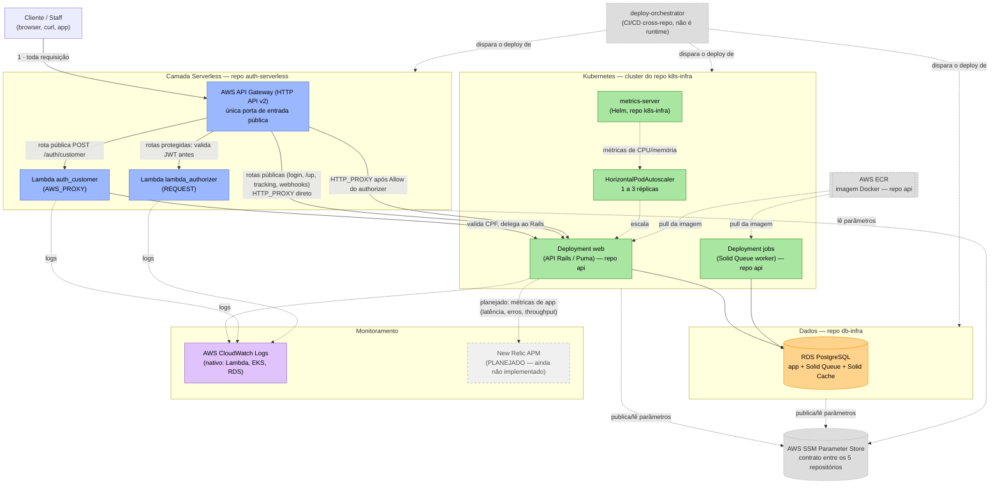

# Diagrama de Componentes — Visão Completa do Sistema

Este documento consolida a visão de **nuvem, APIs, banco de dados e monitoramento** do sistema Oficina Mecânica (Fase 3), atravessando os 5 repositórios do projeto. É um documento **vivo**: deve ser atualizado sempre que a arquitetura mudar (diferente das RFCs/ADRs, que são registros históricos de uma decisão pontual).

> Para o contexto das decisões que geraram esta arquitetura, ver [RFC-001](../RFC-001-authentication-authorization-serverless.md) (autenticação/serverless), [RFC-002](../RFC-002-escolha-da-nuvem.md) (nuvem) e [RFC-003](../RFC-003-escolha-do-banco-e-modelo.md) (banco de dados).

## Diagrama

## Legenda: componente → repositório → responsabilidade

| Componente | Repositório | Camada | Observação |
| :--- | :--- | :--- | :--- |
| API Gateway | `auth-serverless` | APIs / Edge | Única porta de entrada pública do sistema. |
| Lambda `auth_customer` | `auth-serverless` | APIs / Edge | Bridge de autenticação por CPF (não gera token, delega ao Rails). |
| Lambda `lambda_authorizer` | `auth-serverless` | APIs / Edge | Valida assinatura/expiração do JWT antes de liberar rotas protegidas. |
| Deployment `web` (API Rails) | `api` | APIs / Compute | A API de negócio propriamente dita — REST, RBAC, casos de uso. |
| Deployment `jobs` (Solid Queue) | `api` | Compute | Processamento assíncrono (e-mails de notificação). |
| Cluster EKS, VPC, node group | `k8s-infra` | Nuvem | Onde `web`/`jobs` rodam. |
| `metrics-server` + HPA | `k8s-infra` / `api` | Nuvem / Monitoramento | Único mecanismo de observabilidade de infraestrutura hoje. |
| RDS PostgreSQL | `db-infra` | Banco | Único banco do sistema — domínio + Solid Queue + Solid Cache (ver [RFC-003](../RFC-003-escolha-do-banco-e-modelo.md)). |
| ECR | `api` | Nuvem | Registry da imagem Docker da aplicação. |
| SSM Parameter Store | todos | Nuvem | Contrato de dados entre os 5 repositórios (ver RFC-001 §7.3). |
| `deploy-orchestrator` | `deploy-orchestrator` | CI/CD (não é runtime) | Só dispara os deploys dos outros 4 repositórios — não aparece em tempo de execução do sistema. |
| CloudWatch Logs | AWS (nativo) | Monitoramento | Logs brutos de Lambda/EKS/RDS, sempre existem por padrão da AWS, mas **sem dashboard/alerta configurado** hoje. |
| New Relic APM | — | Monitoramento | **Planejado, ainda não implementado** — ver item pendente na próxima seção. |

## Estado do monitoramento (honesto, em 04/09/2026)

Hoje o projeto **não tem uma ferramenta de observabilidade de aplicação** (APM) configurada. O único mecanismo de monitoramento ativo é o `metrics-server` do Kubernetes, usado exclusivamente para alimentar o HPA (decisão de escala automática, não para debugging/alertas). CloudWatch Logs existe de forma passiva (é o comportamento padrão da AWS para Lambda/EKS/RDS), mas sem nenhum dashboard, alerta ou retenção customizada configurados.

A adoção de **New Relic** está planejada, mas ainda sem decisão de escopo (instrumentar só o `api`, ou também as Lambdas do `auth-serverless`) nem implementação. Quando isso for decidido e implementado, este diagrama deve ser atualizado, e o nó `New Relic APM` deixa de ser "planejado" (estilo tracejado) para ser um componente real do sistema.
