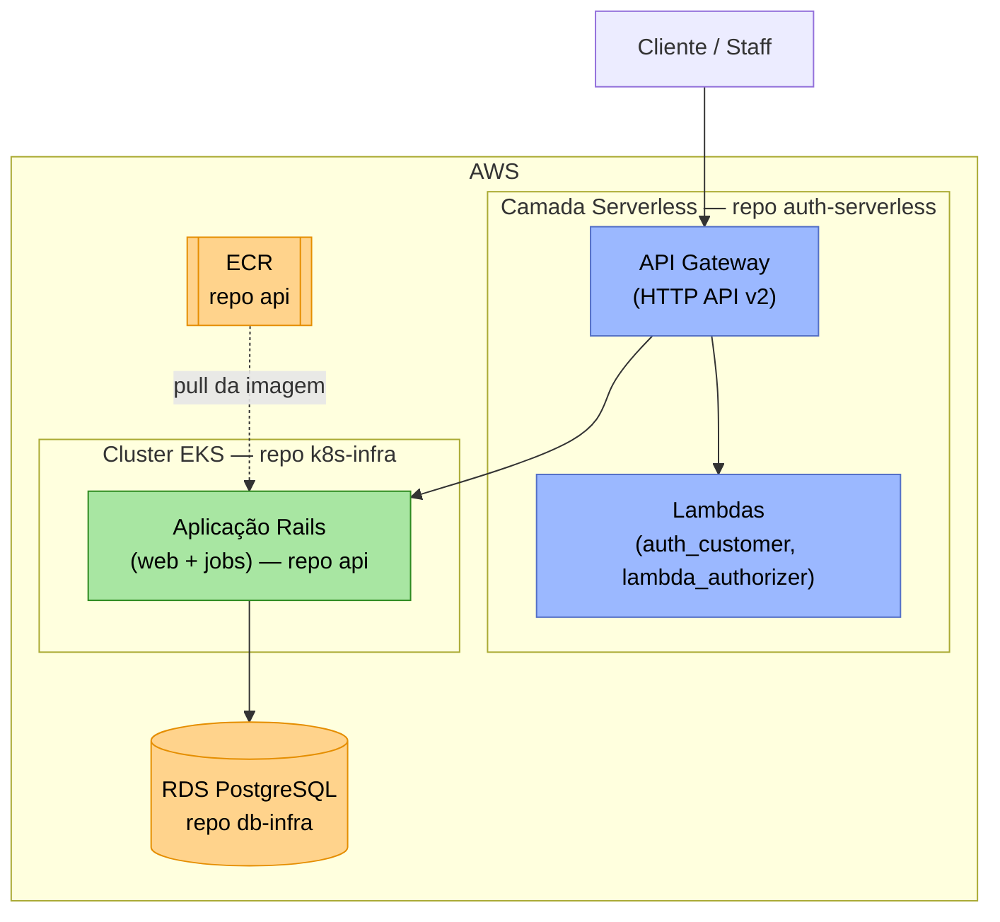
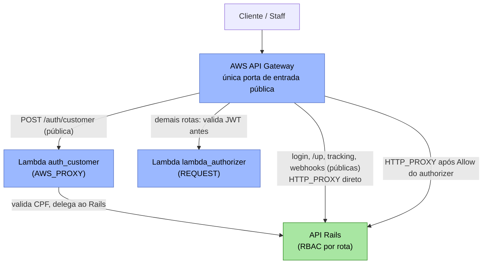
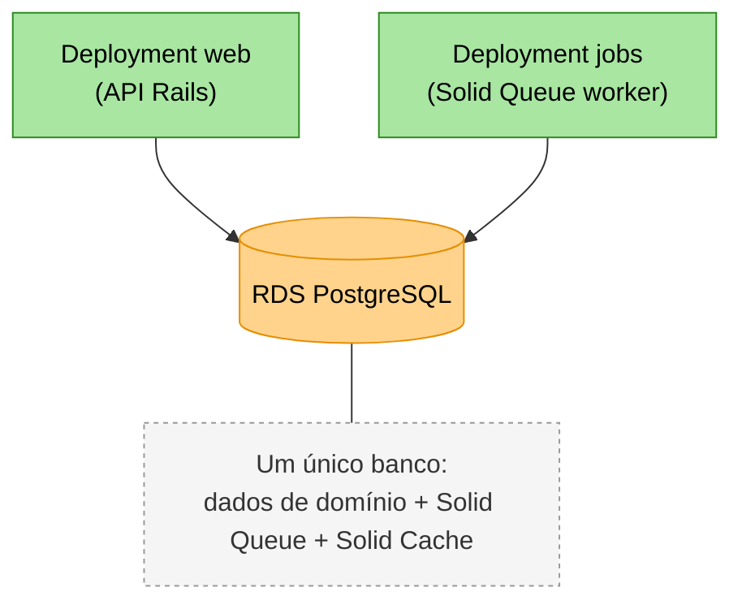
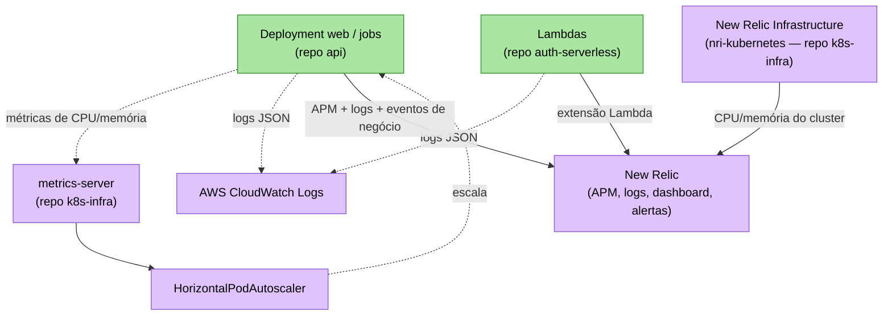

# Diagrama de Componentes — Visão Completa do Sistema

Este documento consolida a visão de **nuvem, APIs, banco de dados e monitoramento** do sistema Oficina Mecânica (Fase 3), atravessando os 5 repositórios do projeto. Para facilitar a leitura, a arquitetura é apresentada em 4 diagramas complementares — um por dimensão — em vez de um único diagrama monolítico.

Este é um documento **vivo**: deve ser atualizado sempre que a arquitetura mudar (diferente das RFCs/ADRs, que são registros históricos de uma decisão pontual).

> Para o contexto das decisões que geraram esta arquitetura, ver [RFC-001](../RFC-001-authentication-authorization-serverless.md) (autenticação/serverless), [RFC-002](../RFC-002-escolha-da-nuvem.md) (nuvem) e [RFC-003](../RFC-003-escolha-do-banco-e-modelo.md) (banco de dados).

## 1. Visão de Nuvem (Topologia)

Panorama geral: onde cada componente roda na AWS e em qual repositório seu provisionamento vive.

Os 5 repositórios do projeto e o contrato de dados entre eles (AWS SSM Parameter Store) estão detalhados na [RFC-001 §7.3](../RFC-001-authentication-authorization-serverless.md).

## 2. APIs — Roteamento e Autenticação

Como uma requisição é roteada a partir do API Gateway, distinguindo rotas públicas e protegidas.

## 3. Banco de Dados

Quem lê/escreve no RDS e o que ele armazena.

Justificativa da escolha do banco e o modelo relacional completo (diagrama ER): [RFC-003](../RFC-003-escolha-do-banco-e-modelo.md).

## 4. Monitoramento

### Estado atual do monitoramento

O monitoramento tem duas camadas complementares:

- **Infraestrutura**: o `metrics-server` do Kubernetes alimenta o HPA (escala automática por CPU/memória); a integração New Relic Infrastructure (`nri-kubernetes`, provisionada via Helm pelo repositório `k8s-infra`) coleta os mesmos recursos do cluster (nodes e pods) para o dashboard. O AWS CloudWatch Logs recebe os logs de Lambda/EKS/RDS de forma nativa.
- **Aplicação**: o agente New Relic APM (`newrelic_rpm`, repositório `api`) instrumenta a API Rails — latência, throughput, erros e distributed tracing — e a extensão Lambda (repositório `auth-serverless`) faz o mesmo para as duas funções serverless. Os logs de ambos são estruturados em JSON e correlacionados por `request_id`/`trace.id`. Eventos de negócio (duração por etapa da OS, falhas de processamento) são registrados como eventos customizados, consultados pelo dashboard e pelas condições de alerta.

O dashboard e a policy de alertas (latência elevada, falhas no processamento de OS/orçamentos, indisponibilidade do healthcheck) são provisionados como código (Terraform, provider `newrelic`) no repositório `k8s-infra`.

## Legenda: componente → repositório → responsabilidade

| Componente | Repositório | Camada | Observação |
| :--- | :--- | :--- | :--- |
| API Gateway | `auth-serverless` | APIs / Edge | Única porta de entrada pública do sistema. |
| Lambda `auth_customer` | `auth-serverless` | APIs / Edge | Bridge de autenticação por CPF (não gera token, delega ao Rails). |
| Lambda `lambda_authorizer` | `auth-serverless` | APIs / Edge | Valida assinatura/expiração do JWT antes de liberar rotas protegidas. |
| Deployment `web` (API Rails) | `api` | APIs / Compute | A API de negócio propriamente dita — REST, RBAC, casos de uso. |
| Deployment `jobs` (Solid Queue) | `api` | Compute | Processamento assíncrono (e-mails de notificação). |
| Cluster EKS, VPC, node group | `k8s-infra` | Nuvem | Onde `web`/`jobs` rodam. |
| `metrics-server` + HPA | `k8s-infra` / `api` | Nuvem / Monitoramento | Mecanismo de observabilidade de infraestrutura (escala automática). |
| RDS PostgreSQL | `db-infra` | Banco | Único banco do sistema — domínio + Solid Queue + Solid Cache (ver [RFC-003](../RFC-003-escolha-do-banco-e-modelo.md)). |
| ECR | `api` | Nuvem | Registry da imagem Docker da aplicação. |
| SSM Parameter Store | todos | Nuvem | Contrato de dados entre os 5 repositórios (ver RFC-001 §7.3). |
| `deploy-orchestrator` | `deploy-orchestrator` | CI/CD (não é runtime) | Dispara o deploy dos outros 4 repositórios — não participa da execução do sistema em produção. |
| CloudWatch Logs | AWS (nativo) | Monitoramento | Logs de Lambda/EKS/RDS, ativos por padrão na AWS. |
| New Relic Infrastructure (`nri-kubernetes`) | `k8s-infra` | Monitoramento | Coleta CPU/memória do cluster EKS via Helm chart. |
| New Relic APM (`newrelic_rpm`) | `api` | Monitoramento | Instrumenta a API Rails — latência, erros, distributed tracing, eventos customizados de negócio. |
| New Relic Lambda Extension | `auth-serverless` | Monitoramento | Instrumenta as duas Lambdas (auth_customer, lambda_authorizer). |
| Dashboard + Policy de Alertas (New Relic) | `k8s-infra` | Monitoramento | Provisionados como código (Terraform, provider `newrelic`) — volume de OS, tempo por etapa, erros, alertas por e-mail. |
