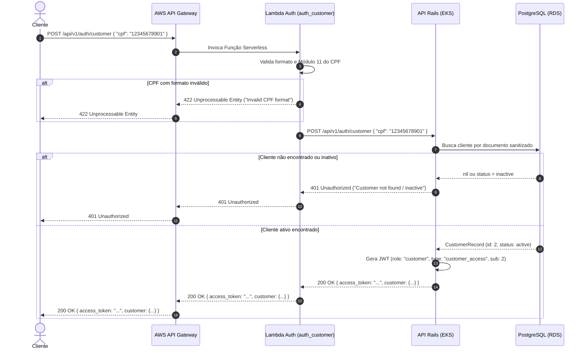
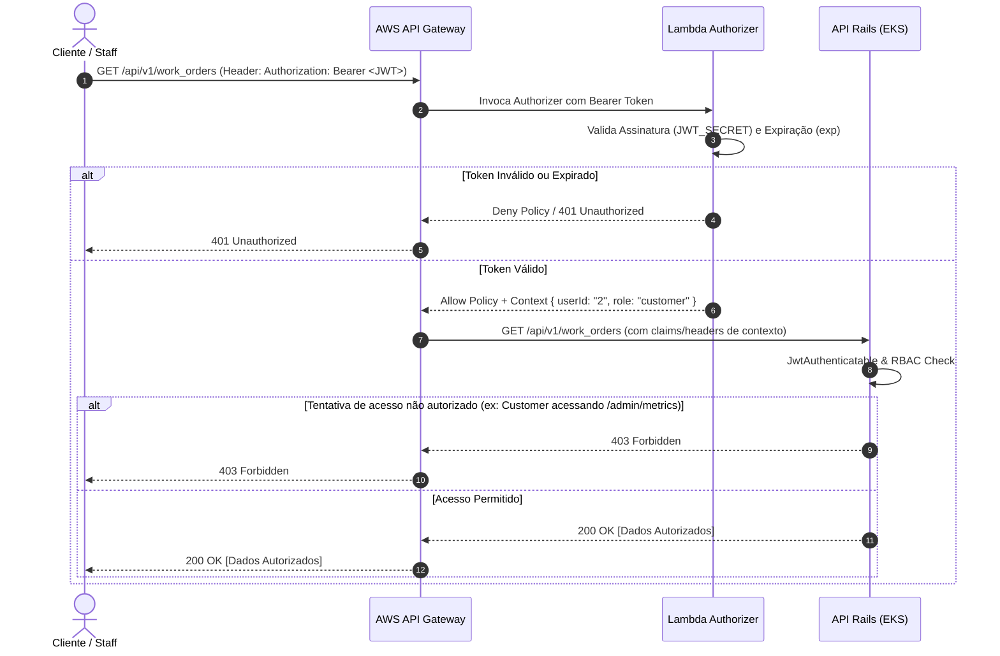

# Diagramas de Sequência

Este documento reúne os diagramas de sequência dos dois fluxos centrais do sistema: **autenticação** e **abertura de Ordem de Serviço**. Os dois de autenticação são a cópia canônica dos que já existem na [RFC-001](../RFC-001-authentication-authorization-serverless.md) §4.2/§4.3 (mantidos aqui para reunir tudo num só lugar) — se este documento e a RFC-001 divergirem no futuro, a versão aqui é a que deve ser considerada atual.

## 1. Autenticação do Cliente por CPF

## 2. Consumo de Rota Protegida (Lambda Authorizer + RBAC)

> **Nota de produção (achado em 04/09/2026):** o Lambda Authorizer, por padrão, cacheia sua decisão por 300s indexada pelo token — e a `policyDocument` retornada tem o `Resource` (ARN) travado na rota da *primeira* chamada. Isso causava `403` incorreto em rotas diferentes com o mesmo token válido dentro da janela de cache. Corrigido fixando `authorizer_result_ttl_in_seconds = 0` (cache desabilitado) em `auth-serverless/infra/apigateway.tf`. Validado manualmente contra o ambiente real (ver [[fase3-multirepo-status]] na memória do projeto).

## 3. Abertura de Ordem de Serviço

Cobre `POST /api/v1/work_orders`, incluindo a validação de que o veículo informado pertence ao cliente (correção do code review) e os dois caminhos possíveis: **sem** itens de linha (status inicial `received`) e **com** itens de linha já na criação (status inicial `diagnosing`, conforme especificação da Fase 2).

```mermaid
sequenceDiagram
    autonumber
    actor U as Cliente / Staff
    participant GW as AWS API Gateway
    participant API as API Rails (CreateWorkOrder)
    participant DB as PostgreSQL (RDS)

    U->>GW: POST /api/v1/work_orders<br/>{ customer_id, vehicle_id, problem_description, line_items? }
    GW->>API: Bearer JWT já validado pelo Lambda Authorizer

    API->>DB: customer_repository.find(customer_id)
    alt Cliente não encontrado
        DB-->>API: nil
        API-->>GW: 422 Unprocessable Entity ("Customer not found")
        GW-->>U: 422
    end

    API->>DB: vehicle_repository.find(vehicle_id)
    alt Veículo não encontrado
        DB-->>API: nil
        API-->>GW: 422 ("Vehicle not found")
        GW-->>U: 422
    else Veículo encontrado, mas pertence a OUTRO cliente
        DB-->>API: Vehicle { customer_id: outro }
        API-->>GW: 422 ("Vehicle does not belong to customer")
        GW-->>U: 422
    else Veículo válido e do cliente
        API->>API: monta WorkOrder (status inicial = "received")
        opt line_items informados na criação
            loop para cada item
                API->>DB: busca snapshot (service ou inventory_item, conforme item_type)
                alt referência não encontrada
                    DB-->>API: nil
                    API-->>GW: 422 ("Service not found" / "Inventory item not found")
                    GW-->>U: 422
                else encontrado
                    DB-->>API: nome + preço atuais
                    API->>API: adiciona LineItem com name_snapshot/price_snapshot congelados
                end
            end
            API->>API: status passa a "diagnosing" (já tem itens)
        end
        API->>DB: work_order_repository.save(work_order)
        DB-->>API: WorkOrder persistido (id, protocol gerado)
        API-->>GW: 201 Created + WorkOrder
        GW-->>U: 201 Created
    end
```

